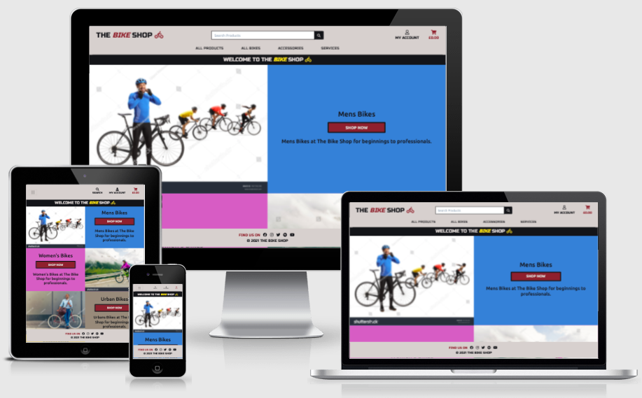

# The Bike Shop

## Code Institute - Milestone Project 4

<a href="https://the-bike-shop-project.herokuapp.com/" target="_blank">Click here to view The Bike Shop live</a>

## Table of contents
1. [Introduction](#introduction)
1. [Project Introduction](#project-introduction)
1. [UX Design](#ux-design)
    * [User Demographic](#user-demographic)
    * [Main Aims](#main-aims)
        - [User Goals](#user-goals)
        - [Site Owner Goals](#site-owner-goals)
        - [Developer Aims](#developer-aims)
1. [User Stories](#user-stories)
1. [Development Process](#development-process)
1. [My Strategy](#my-strategy)
    * [General](#general)
    * [Unregistered Users](#unregistered-users)
    * [Registered Users](#registered-users)
    * [Store Owner/Admin](#store-owner-or-admin)
1. [My Design](#my-design)
    * [Hero Images](#hero-images)
    * [Colour Scheme](#colour-scheme)
    * [Typography](#typography)
    * [Imagery](#imagery)
1. [Products and Services](#products-and-services) 
    * [Products](#products)
    * [Services](#services)
1. [Wireframes](#wireframes)
1. [Features](#features) 
    * [Navbar](#navbar)
        - [Desktop Navbar](#desktop-navbar)
        - [Mobile Navbar](#mobile-navbar)
    * [Registration Page](#registration-page)
    * [Homepage](#homepage)
    * [Footer](#footer)
    * [Products Pages](#products-pages)
    * [Product Detail Page](#product-detail-page)
    * [Toasts](#toasts)
    * [Services Page](#services-pages)
    * [Service Booking Page](#service-booking-page)
    * [Login Page](#login-page)
    * [Profile Page](#profile-page)
    * [Logout Page](#logout-page)
    * [Shopping Cart Page](#shopping-cart-page)
    * [Checkout Page](#checkout-page)
    * [Order Summary Page](#order-summary-page)
1. [Stripe](#stripe)

[Back to top ⇧](#the-bike-shop)

## Introduction
This Milestone project (Full Stack Frontend Development) is the fourth and final project to contribute towards my Full Stack Web Developer Diploma with Code Institute. 

The main requirements in this project are to design a Full-Stack e-commerce website based around business logic to control a centrally-owned dataset. The site setup includes an authentication mechanism with the option for users to pay for products and services with a further option to register for an account to access orders after a purchase has been made. There also is a site administrator login for the owner of the site to access and give them the option to add new products, edit existing products. delete products and gain access to customer orders and login details giving full management of the site. The main technologies used to achieve this project is HTML, CSS using the Bootstrap5 framework, JavaScript using the jQuery library, Python using the Full framework, Django (Model Template View - MVT architecture), Relational Databases - MySQL and Postgres, and Stripe - payment processing platform. 

Django Data Structure - MVT architecture (Model Template View) 

- Model – Represents the data from the database in order for the application to work 

- Template – Presents the layer and defines how information is displayed to the end user 

 - View – Defines the business logic that links the templates to the models 

 ## Project Introduction 

 The Bike Shop is an easy-to-use online shopping experience for cycling lovers to visit and purchase products and services. Products available to purchase are Men's bikes, Woman's bikes, Urban bikes, Cycling Helmets and general accessories. Before purchasing any product, users can get access to more information about that product with the option to pick a size (if applicable). The services available to book on the site is professional bike cleaning, bike repair and a sell your bike scheme. The user will need to select, add and submit relevant information depending on what service they are looking to purchase one of these services.  

 Date this project started: 20th December 2021 

 ## UX Design

 ### User Demographic

- For adult cyclists only  
- For cycling enthusiasts who want to purchase their first adult bike for enjoyment 
- For cycling enthusiasts who want to purchase their first adult bike for fitness 
- For cyclists that want to upgrade their current bike to something more advanced 
- For cyclists that want to purchase additional accessories for comfort and safety 
- For anyone wanting to start cycling to work  
- For cyclists to take up the offer of The Bike Shop services (clean, repair and sell) 

### Main Aims

#### User Goals 

- To view all products and services on the site 
- To search for a product or service quickly by keyword(s) - To find the right type of bike based on my requirements around cycling 
- To find the right bike accessories for my requirements around cycling 
- Find the right service for my bike i.e., clean, repair and/or sell 
- Register an account to view orders and to make it easier to order in the future 
- To easily login to my account 
- To view previous orders 
- To view saved profile details i.e., contact number and address with the option to update details 
- To add a product(s) of choice to my shopping bag 
- To view my shopping bag before purchase 
- To update and/or remove a product from my shopping bag 
- To complete a purchase using an online card payment system 
- To receive confirmation of order on the site and via email 
- To easily logout of my account 

### Site Owner Goals 

- ‘Admin’ username and password login 
- Access to 'Product Management’ 
- Access to 'Service Management' 
- Add a new product or service 
- Edit a current product or service 
- Delete a current product or service 
- Admin access to view, update and/or delete products, services and users 
- **CRUD** conventions realised and achieved 
(Create, Read, Update and Delete)

### Developer Aims 

- Create an interesting and easy to use e-commerce website for cycling lovers to visit and make purchases 
- A platform for Film lovers to use to Create, Read, Update and Delete Film Records 
- Demonstrate the use of front-end and back-end Web development languages recently learnt with CI. 
- The use of relational databases to storge product data and user details to easily update, add and delete when required 
- Successful deployment adding to the developer portfolio
- To achieve a final grade to contribute towards the Full Stack Web Developer Diploma overall grade 

## User Stories

Click this link to see all <a href="https://github.com/liamwalsh1980/Milestone-Project-4/blob/main/readme/pdf/user-stories.pdf" target="_blank">User Stories</a>

## Development Process 

As this project is focused on full stack development and using a relational database with Stripe Payments, more time was given to the preparation of the site based on UX Design, the data for the site whilst keeping a full focus on the user goals, site owner goals, developer goals and user stories. 

## My Strategy 

After looking back over my previous projects, I decided to breakdown my strategy into sections making the development process easier to delivery. This gave me a better understanding of what I needed to include and what would be more important from the point of view of an end user, store owner and the developer of the application.  

### General 

- Logo (desktop only) 
- Search facility 
- Sort facility 
- Navbar list for desktop 
- Burger Navbar for mobile and tablet 
- Subscribe option 
- Strong Hero Image on the Homepage 
- Header 
- Shop Now button 
- Shopping cart 

### Unregistered Users
- Need to be able to: 
    - Search for products and services 
    - View products/services 
    - Use the sort facility  
    - View details of each product/service
    - Buy products and services as a guest 
    - Receive an email confirmation for all purchases made
    - Register an Account using a username and secure password (optional) 

### Registered Users 
- Need to be able to: 
    - Login with username and password 
    - Search for products and services 
    - View products/services 
    - Use the sort facility
    - View details of each product/service 
    - Buy products and services  
    - Receive an email confirmation for all purchases made 
    - Access Profile - delivery details 
    - Access Profile - order history (if applicable)
    - Logout 

### Store Owner or Admin
- User needs to be able to: 
    - Login with username and password
    - Search for products and services 
    - View products/services 
    - Use the sort facility 
    - View details of each product/service 
    - Buy products and services  
    - Receive an email confirmation for all purchases made
    - Access Profile - delivery details 
    - Access Profile - order history (if applicable)
    - Add new Products/Services 
    - Update Products/Services 
    - Delete Products/Services 
    - Logout
    - Access Django Administration 

With these goals in mind, I put together diagrams that shows the importance and Viability relevant to each. 

 

## My Design 

I wanted this project to have minimum text and therefore it is important to note that I made sure that from the products sold, services sold, images used, nav links applied, my colour scheme, text styling picked and the name of the site, it is clear what this site offers and who the target audience is.  

### Hero Images 

The hero images came from Shutterstock at small cost of £1.90 per image. I found a few good images that I believe would work well for the homepage. The originally idea which can be seen in my wireframes is to use one image with a ‘Shop Now’ button in the middle.  

This looked fine; however, I felt the homepage needed more images in sections to represent what the site was about and the what target audience I was aiming for. With this in mind I used 4 different images representing the 4 main product categories. 

The sport of cycling is very colourful with Bikes, Clothing, Helmets and Competition Winning Jerseys all represented with bright colouring. With this in mind the first image users will see contains plenty of colour with a male cyclist as the main focus. I then used 3 more images to represent women's bikes, urban bikes and accessories.  

Please see the credits section for information about where the images were sourced from.  

### Colour Scheme

I wanted a strong bright colour to represent the shop well. I used the colours from the accessories Hero image on the homepage to use throughout the site starting with Minion Yellow. I then wanted a contrasting colour like black to compliment this Yellow, therefore I used the same shade of black from the accessories hero image which is called Rich Black. The light grey called Timberwolf was also sourced from the background of this hero image. I then used Coolors.co to extract 2 more colours which sits between Minion Yellow and Timberwolf called Flax and between Timberwolf and Rich Black called Sonic Silver.  

The Bike Shop – Colour Pallet from coolors.co

Once I had finished building the homepage, I wanted the logo and ‘Shop Now’ button to standout more. Therefore, I decided to add a new colour to achieve this. The colour chosen is a deep red (Antique Ruby). I Also used the next shade across from this colour for hovering over. This shade I chose is called Cordovan red. This is used for the category links on the products and services pages. Both colours sourced from coolors.co like my main palette. 

### Typography

I used Google fonts to home in on 2 fonts needed for this project.  

For the logo text I chose the font style – <a href="https://fonts.google.com/specimen/Russo+One" target="_blank">Russo One</a> to give the logo a striking and bold look. This I believe would show users that the site is built with personality and style encouraging them to stay on the site and explore the products and services.  

For the main content of the site, I used a reliable font called <a href="https://fonts.google.com/specimen/Russo+One" target="_blank">Ubuntu</a>. I tested this font with varies product and service titles and made sure it looked good across all font sizes from 8px upwards. 

### Imagery

With around 53 products and services, each with an image to show users what they are buying, I felt it best to keep the background of the site plain white. This works well to clearing show all images. However, I decided to break up this background colour by using the Timberwolf grey from my colour palette in the header and footer of the site.  

I looked at using a ‘bike’ image to replace the word Bike from the logo title. Instead, I simply added a font awesome image of a bike to the end of the text logo. 

Several other font awesome images were used to show Customer Account, Shopping bag, services offered and certain fields within all products I.e., Rating star and product tag.  

I used the noimage.png image in this project in case there was no available image for any product or service that is added to the site. This simply fills a gap to make sure good UX is maintained.  

## Products and Services 

With around 53 products and service added I wanted to make sure each one was allocated into a category name. I also wanted to make sure that the products had the same format of fields for consistency, giving users the same type of useful information for all products and services.

### Products 

### Services 

 
## Wireframes 

All Wireframes were designed for laptop/computer, iPad/tablet and mobile display: 

Please click <a href="https://github.com/liamwalsh1980/Milestone-Project-4/blob/main/readme/pdf/The-Bike-Shop-Wireframes.pdf" target="_blank">PDF Wireframes </a> to see wireframes in pdf format

## Features

### Navbar 

The Navigation menu is displayed across all web pages and across all screen sizes for users to move through the website easily and quickly. It's displayed with a different background colour (Timberwolf grey) to the body of the website. The font styling for text links is the same as the logo (Russo One). 

#### Desktop Navbar 

The Navigation menu on desktop screens has a text logo with a bike icon. This can be found at the top left of the navbar. Users can click this logo and it will take them back to the homepage. The word ‘Bike’ changes colour when a user hovers over it giving them an indication that it’s a clickable logo. Users will find a search bar to use to search for products and the following links positions to the right: - 

- User icon (My Account) 
- Shopping cart icon (starts with £0.00) 

Below the search bar in a horizontal row users can find the following links to click on: - 

Products 
-    By Price 
-    By Rating 
-    By Category 
-    All Products 

Bikes 
-    Mens Bikes 
-    Womens Bikes 
-    Urban Bikes 
-    All Bikes 

Accessories 
-    Helmets 
-    Other Accessories 
-    All Accessories 

Services 
-    Cleaning 
-    Repair 
-    Sell Your Bike 
-    All Services 

#### Mobile Navbar 

On mobile and tablet screens, the navigation bar is displayed using the hamburger menu icon in the top left replacing the logo. This is done to give better UX when viewing the site on smaller screens. Users can click the hamburger menu which opens up the same link options as desktop users. The ‘User’ icon (My Account) and ‘Shopping Cart’ icon (Starts with £0.00) remains in place however the search bar is replaced with the ‘Search’ icon for users to click on. When users click the ‘Search’ icon the search bar appears below. 

Navigation links on the top right update depending on the user being logged in and whether that user is a regular shopping or administrator.  

### Registration Page 

Users are encouraged to register an account but it’s not mandatory and therefore they can still make purchases without an account. Upon making a purchase users will still receive an email confirmation and immediate notification that their order has been received once they click the ‘Complete Order’ button on the Delivery and Payment page. 

The process to register an account is simple. Click the ‘Account’ button at the top of the navigation menu which will open a dropdown menu to either ‘Login’ or ‘Register’ Once the ‘Register’ link is clicked the user will need to provide the following: -  

- Username  
    - This can be anything as long as it's not been used already 
    - An error message will appear immediately if the username already exists 

- Email Address  
    - The user will need to add their email address twice for secure and avoid any typo mistakes made 

- Password  
    - The user will need to add a password twice for security and to avoid any typo errors made by mistake 

Once this process is complete the user will see notification on the registration page that their account is active and verification is required. At the same time the user will receive an email confirmation to verify their account by clicking a link from within the body of the email. Once verified the user can: -  

- Login using their username and password  
(A password recovery option is available if required)
- Access their personal profile page 
    - Save delivery address and contact information
    - Update delivery address and contact information 
    - View order history (if any) 

Admin User will have additional access to the following: 

- Product Management page
(CRUD – Create, Read, Update Delete achieved) 
    - View current products and services 
    - Add a product or service 
    - Edit a product or service (Edit Page) 
    - Delete a product or service 
    - Access the Admin page  
        - User accounts 
        - Change user account details and permission level
        - Delete accounts 
        - Orders received 
        - Categories 
        - Products 
        - URLs

### Homepage

Users will see 4 sections on the homepage with each section split in half. All sections have different background colouring with an image making up one side and a large ‘Shop Now’ button centred which makes up the other side making it easy for users to click through to the products they are interested in. The 4 sections represent products for sales in regards to mens bikes, women's bikes, urban bikes and accessories.  

At the top just above the sections users will see a fixed banner welcome message which stays in place across all web pages. I feel this nicely breaks up the navbar and body of each page. The banner stating the website name ‘The Bike Shop’ is very important to have on smaller screens because the logo has been removed and replaced by the hamburger menu icon for good UX. The banner is also a link back to the homepage and again important to have on smaller screens when the logo is replaced by the hamburger menu icon. 

### Footer 

A footer has been added to the site to show users a nice finish to each page. With good UX in mind users will see that the footer has the same font styling and colouring as the navbar at the top. Users will see social media icons available to click on to take them to a new webpage associated to which ever icon is clicked. All social media icons change colour (Antique Ruby) when hovering over them.

### Products Pages

Within all the products pages users can browse through the products, each giving the following: - 

- Products image 
- Product name 
- Price 
- Category tag 
- Rating 

All products are boxed individually showing separation from each.  

The Products available upon deploying the site is as follows: - 

- Men's Bikes 
- Women’s Bikes 
- Urban Bikes 
- Helmets 
- Other Accessories 

Users can also sort by: - 

- Price 
- Rating 
- Category 

The ‘Products > By Price’ page contains a subheader below the banner along with an indication of how many products are on this page and a small text link to go back to the All Products page if required. This page sorts all products by Price order starting with lowest price products first.  

The ‘Products > By Rating’ page contains a subheader below the banner along with an indication of how many products are on this page and a small text link to go back to the All Products page if required. This page sorts all products by Rating order starting with highest rating products first. 

The ‘Products > By Category’ page contains a subheader below the banner along with an indication of how many products are on this page and a small text link to go back to the All Products page if required. This page sorts all products by Category order, alphabetically. 

The ‘Products > All Products’ page contains a subheader below the banner along with an indication of how many products are on this page. This page is not sorted in anyway however, like on all Product pages, users will see on the right side near the top a ‘sort’ feature where users can sort by price, rating, name and category either by ascending or descending order. 

The ‘Bikes > Mens Bikes’ page contains a subheader below the banner along with an indication of how many products are on this page and a small text link to go back to the All Products page if required. This page shows just Mens Bikes with the option on the right side near the top a ‘sort’ feature where users can sort Mens Bikes by price, rating, name and category by ascending or descending order. 

The ‘Bikes > Womens Bikes’ page contains a subheader below the banner along with an indication of how many products are on this page and a small text link to go back to the All Products page if required. This page shows just Womens Bikes with the option on the right side near the top a ‘sort’ feature where users can sort Womens Bikes by price, rating, name and category by ascending or descending order. 

The ‘Bikes > Urban Bikes’ page contains a subheader below the banner along with an indication of how many products are on this page and a small text link to go back to the All Products page if required. This page shows just Urban Bikes with the option on the right side near the top a ‘sort’ feature where users can sort Urban Bikes by price, rating, name and category by ascending or descending order. 

The ‘Bikes > All Bikes’ page contains a subheader below the banner along with an indication of how many products are on this page and a small text link to go back to the All Products page if required. Below the subheader users will see small badges which are links to other options within this category. This page shows All Bikes with the option on the right side near the top a ‘sort’ feature where users can sort All Bikes by price, rating, name and category by ascending or descending order. 

The ‘Accessories > Helmets’ page contains a subheader below the banner along with an indication of how many products are on this page and a small text link to go back to the All Products page if required. This page shows just Helmets with the option on the right side near the top a ‘sort’ feature where users can sort Helmets by price, rating, name and category by ascending or descending order. 

The ‘Accessories > Other Accessories page contains a subheader below the banner along with an indication of how many products are on this page and a small text link to go back to the All Products page if required. This page shows just Other Accessories with the option on the right side near the top a ‘sort’ feature where users can sort Other Accessories by price, rating, name and category by ascending or descending order. 

The ‘Accessories > All Accessories’ page contains a subheader below the banner along with an indication of how many products are on this page and a small text link to go back to the All Products page if required. Below the subheader users will see small badges which are links to other options within this category. This page shows All Accessories with the option on the right side near the top a ‘sort’ feature where users can sort All Accessories by price, rating, name and category by ascending or descending order. 

Users can add the product to their shopping cart directly on this page by selecting the following: -  

- Size - if applicable, a size must be selected 
- Quantity - any quantity between 1 and 20 will need to be selected, otherwise the user will see an error message and the item(s) won’t be added to the user's cart until a quantity between 1 and 20 is selected. 

If a user is interested in a product but want more information before purchasing, they can click on that product which takes them to the Product page giving them more details and the option to add to their basket.  

At the right side, bottom of every products page, users can click the ‘back to top’ cursor which is an up arrow in a small round background. Clicking this will bring users to the top of the page the user is on. 

### Product Detail Page

Users can click through to a product detail page for each product showing the user a bigger image to look at and more details about the product chosen. Users will know quickly what product detail page they are on as the product name is displayed as a header at the top above the image. Users can also click the image again which opens up a new web page tab showing just the image with black background. 

Users will see the Product Name, Price, Category (link to go to all products within that category), customer rating out of 5.0 and a product description. 

Users can add the product to their shopping cart by selecting the following: -  

- Size - if applicable, a size must be selected 
- Quantity - any quantity between 1 and 20 will need to be selected, otherwise the user will see an error message and the item(s) won’t be added to the user's cart until a quantity between 1 and 20 is selected.  

Once a user selects a size (if applicable) and quantity, they can then click the ‘add to cart’ button.  

If a user changes their mind, they can click the ‘Go Back’ link taking them back to the products page within the specific product category.  

### Shopping Cart Page  

Users can access their cart at any point by clicking the ‘cart’ icon at the top right on any page. If a user clicks this when they have no products in the cart, they will be taken to an empty shopping cart page and they will see a message with a ‘sad’ face icon and a ‘Shop Now’ button below to click on. This will take them back to the products page to start shopping.  

If a user has at least 1 product in their shopping cart they will see the following when they click their cart.  

- Product Image 
- Product Information with size if applicable 
- Price of the product 
- Qty (Quantity) which includes a decrease/increase option and text links to ‘Update Qty’ or ‘Remove All’. If the user reduces the quantity to Zero the product will be removed from the shopping cart. Clicking the ‘Update Qty’ link will update the shopping cart, subtotal and the top right value of the shopping cart in the navigation menu. Clicking the ‘Remove All’ link will simply remove the product from the shopping cart and take the user to the empty shopping cart page 
- Subtotal which is the product price times the quantity selected.  
- Grand total which will be no different than the Subtotal as they delivery charge is free at The Bike Shop.  
- ‘Keep Shopping’ text link which takes user back to the products page 
- ‘Secure Checkout’ button which takes the user to a secure payment page to complete their order.  

### Checkout Page 

When the user lands on the checkout page, they will see 2 sections. On desktop these sections sit horizontally and on mobile they sit vertically. The first section users will see is the ‘Please fill out the form below to complete your order’ section to complete. It’s a simple form for users to complete their order which includes: - 

- Details 
    - Full Name (Mandatory field) 
    - Email Address (Mandatory field) 
 
- Delivery 
    - Phone Number (Mandatory field) 
    - Country (Mandatory field) 
    - Postal Code  
    - Town or City (Mandatory field) 
    - Street Address 1 (Mandatory field) 
    - Street Address 2 (Mandatory field) 
    - County (Mandatory field) 
    
If a user is logged in to their account, they have the option to tick/untick the ‘Save this delivery information to my profile’ checkbox. It's checked by default.  

If a user doesn't have an account or isn’t logged in the user will see ‘Create an account or login to save this information’ options to click on.  

- Payment (Stripe Element) 
    - Card Number / MM/YY CVC (Mandatory field) 

If a user types an incorrect card number they will see an error message - 'Your card number is invalid message'

Below this, users will see a ‘Complete Order’ button to click on to complete their purchase with a clear indication below of how much the user's card will be charged. If the user wants to go back to either adjust their shopping cart or change their mind on buying altogether, they can click the ‘Adjust Cart’ text link which sits to the left of the ‘Complete Order’ button

The next section called ‘Order Summary - Your Shopping Cart Has (?) products’ is for users to view what is in their shopping cart before they place their order.  

On this page users will be notified immediately if they haven’t completed the form properly as most of this page has mandatory fields that need information adding to complete an order. 

Further authentication - Users will notice that when they have completed the order form and clicked the ‘Complete Order’ there is a short delay while their payment goes through. They will see light green background overlay and a loading spinner showing their order is going through the process payment. They are then given the option of completing their purchase or cancelling it. If they cancel the order the user is taken back to the order ‘Checkout’ page where all their details remain in place and a ‘red’ notice warning at the bottom saying ‘We are unable to authenticate your payment method. Please choose a different payment method and try again’. If the user clicks to proceed with their purchase, they will see the light green background overlay and the loading spinner again  

### Order Summary Page  

Once the checkout page with the customer payment is completed the user will be taken to an order summary page. On this page users will see a full breakdown of their order giving them the following: - 

- Order Info (Unique Order Number and Order Date and Time) 
- Order details (Products ordered with size confirmed if applicable) 
- Delivering to (Full Name, Address, Phone Number) 
- Billing info (Order total and Grand total) 

Below, users will see a ‘Shop Again’ button to take them back to the products page to shop again if they choose to.  

Users will be notified that an email confirmation has been sent and a 'Thank you’ as the header at the top of the page.  

Users will also see a popup success toast message confirming their order is successfully processed, what their unique order number is and that they will receive an email. This message closes automatically after 10 seconds like all the toasts on the site do.  

### Toasts 

There are Bootstrap Toasts displayed under the navbar, providing users with real-time feedback on their actions.  

‘Success’ toasts are represented with a green colour border and displayed for users when they do the following: - 

- Add a product to their cart  
- Update a product quantity 
- Remove a product from their cart 
- Login
- Logout
- Signup
- Complete an order

Users will see a toast message pop up confirming the following information: - 

- A relevant message of whether the user has added, updated or removed a product 
- Confirmation of how many products is in the shopping cart 
- A list of products including an image, product name, Quantity and Size (if applicable) 
- A ‘Go to secure checkout’ button or ‘Shop Now’ button if the shopping cart is empty. 

‘Error’ toasts are represented with a red colour border and displayed for users when they do the following: - 

- Attempting to remove a product and an error occurs.  

Other success toasts are also in place.  

- ‘Warning’ represented with a yellow colour border 
- ‘Info’ represented with an aqua colour border. This toast has the ‘Warning!’ text for reference.  

All toasts include a cross icon in the top right for user to click on to close the toast. Alternatively, after 10 seconds the toast will automatically close.  

### Service Page

### Service Booking Page

### Login Page 
 
### Profile Page 
 
### Logout Page

## Stripe 

Stripe offers software APIs to accept payments, send payments and manage all business transactions online with complete security. I setup an account with Stripe using my own email address to use the accept payments option. The option used is called Stripe Elements to add a prebuilt credit card input to my form on the checkout page.  

I then installed Stripe using the command: - 

- **$ pip3 install stripe**

Exporting the public key in version control using the command: - 

- **$ export STRIPE_PUBLIC_KEY=[*KEY*]**

Exporting the secret key in version control using the command: - 

- **$ export STRIPE_SECRET_KEY=[*KEY*]**

As this won’t permanently export, I added both keys to my gitpod main workspace page by going to settings > variables > new variable. 

I then created a ‘paymentIntent’ using Stripe to test that the cart total is coming through by using the python print function to show the total in the terminal.  

I then added a listener to the payment form submit event and used the code from Stripe Docs to do this and with a few adjustments: -  

- Disable the card element to prevent multiple submissions 
- Disable the submit button to prevent multiple submissions 
- Delete the billing details  
- Change some of the syntax to camelCase for best practice 
- Provide the card to stripe and then execute this function on the result 
- Place the error into the card error div 
- Complete indentation 

Then I tested the form using the default credit card number provided by stripe to make sure the ‘paymentIntent’ is successful.  

After completing some code logic in views.py I then created a checkout success template which mirrors the format of the checkout.html. This template takes the order number and renders a success page letting users know their payment is completed successfully.  

‘If’ statements were added to the checkout success template for the street address2, county and postcode as these fields aren’t mandatory for users to complete and will only be displayed in the order summary if they user completes them.  

The logic is set so that when an order is completed by a user their products in the shopping cart will be deleted.  

I then added some redundancy in case a user closes the browser window after a payment is confirmed but before the form is fully submitted and the payment is taken but the order isn't received by the shop owner. I used Stripe webhooks signals to help prevent this.  

Also exported and added to the gitpod main workspace as a new variable is the STRIPE_WH_SECRET 

- **$ export STRIPE_SECRET_KEY=[*KEY*]**

To ensure orders are entered into the database even in the event of a user error during the checkout process, I made sure that customer information was passed through a Stripe payment intent as metadata. This tested by printing the intent to the terminal.  

I then made some changes to the model by adding a couple of new fields to stop a user from creating identical orders in error. The first is a text field that will contain the original shopping cart that created it. The other is a character field that will contain the stripe payment intent ID which is guaranteed to be unique. Once this is done, I then migrated these changes using the makemigrations (with dry run) and migrate (with plan). I then added these fields to the admin side to finish.  

After finishing up the code I then tested that Stripe payments work by adding an order to the shopping cart and then making a purchase using Stripes test credit card number. Tested was completed after being taken to the ‘Order Summary page’, seeing the success toast, checking Stripe webhooks and going into the admin. 

I also added django-countries to gain access to the pre-built country field containing all the valid country codes i.e., GB using the following command and then used the freeze requirements command to bring it all up to date.  

- **$ pip3 install django-countries**
- **$ pip3 freeze > requirements.txt**

