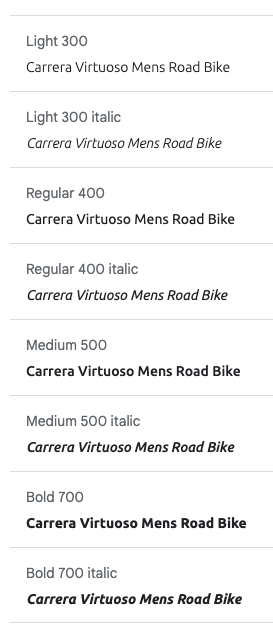
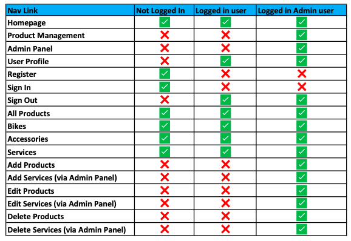

# The Bike Shop

## Code Institute - Milestone Project 4

<a href="https://the-bike-shop-project.herokuapp.com/" target="_blank">Click here to view The Bike Shop live</a>

## Table of contents
1. [Introduction](#introduction)
1. [Project Introduction](#project-introduction)
1. [UX Design](#ux-design)
    * [User Demographic](#user-demographic)
    * [Main Aims](#main-aims)
        - [User Goals](#user-goals)
        - [Site Owner Goals](#site-owner-goals)
        - [Developer Aims](#developer-aims)
1. [User Stories](#user-stories)
1. [Development Process](#development-process)
1. [My Strategy](#my-strategy)
    * [General](#general)
    * [Unregistered Users](#unregistered-users)
    * [Registered Users](#registered-users)
    * [Store Owner/Admin](#store-owner-or-admin)
1. [My Design](#my-design)
    * [Hero Images](#hero-images)
    * [Colour Scheme](#colour-scheme)
    * [Typography](#typography)
    * [Imagery](#imagery)
1. [Products and Services](#products-and-services) 
    * [Products](#products)
    * [Services](#services)
1. [Wireframes](#wireframes)
1. [Features](#features) 
    * [Navbar](#navbar)
        - [Desktop Navbar](#desktop-navbar)
        - [Mobile Navbar](#mobile-navbar)
    * [Registration Page](#registration-page ) 
    * [Footer](#footer)

[Back to top ⇧](#the-bike-shop)

## Introduction
This Milestone project (Full Stack Frontend Development) is the fourth and final project to contribute towards my Full Stack Web Developer Diploma with Code Institute. 

The main requirements in this project are to design a Full-Stack e-commerce website based around business logic to control a centrally-owned dataset. The site setup includes an authentication mechanism with the option for users to pay for products and services with a further option to register for an account to access orders after a purchase has been made. There also is a site administrator login for the owner of the site to access and give them the option to add new products, edit existing products. delete products and gain access to customer orders and login details giving full management of the site. The main technologies used to achieve this project is HTML, CSS using the Bootstrap5 framework, JavaScript using the jQuery library, Python using the Full framework, Django (Model Template View - MVT architecture), Relational Databases - MySQL and Postgres, and Stripe - payment processing platform. 

Django Data Structure - MVT architecture (Model Template View) 

- Model – Represents the data from the database in order for the application to work 

- Template – Presents the layer and defines how information is displayed to the end user 

 - View – Defines the business logic that links the templates to the models 

 ## Project Introduction 

 The Bike Shop is an easy-to-use online shopping experience for cycling lovers to visit and purchase products and services. Products available to purchase are Men's bikes, Woman's bikes, Urban bikes, Cycling Helmets and general accessories. Before purchasing any product, users can get access to more information about that product with the option to pick a size (if applicable). The services available to book on the site is professional bike cleaning, bike repair and a sell your bike scheme. The user will need to select, add and submit relevant information depending on what service they are looking to purchase one of these services.  

 Date this project started: 20th December 2021 

 ## UX Design

 ### User Demographic

- For adult cyclists only  
- For cycling enthusiasts who want to purchase their first adult bike for enjoyment 
- For cycling enthusiasts who want to purchase their first adult bike for fitness 
- For cyclists that want to upgrade their current bike to something more advanced 
- For cyclists that want to purchase additional accessories for comfort and safety 
- For anyone wanting to start cycling to work  
- For cyclists to take up the offer of The Bike Shop services (clean, repair and sell) 

### Main Aims

#### User Goals 

- To view all products and services on the site 
- To search for a product or service quickly by keyword(s) - To find the right type of bike based on my requirements around cycling 
- To find the right bike accessories for my requirements around cycling 
- Find the right service for my bike i.e., clean, repair and/or sell 
- Register an account to view orders and to make it easier to order in the future 
- To easily login to my account 
- To view previous orders 
- To view saved profile details i.e., contact number and address with the option to update details 
- To add a product(s) of choice to my shopping bag 
- To view my shopping bag before purchase 
- To update and/or remove a product from my shopping bag 
- To complete a purchase using an online card payment system 
- To receive confirmation of order on the site and via email 
- To easily logout of my account 

### Site Owner Goals 

- ‘Admin’ username and password login 
- Access to 'Product Management’ 
- Access to 'Service Management' 
- Add a new product or service 
- Edit a current product or service 
- Delete a current product or service 
- Admin access to view, update and/or delete products, services and users 
- **CRUD** conventions realised and achieved 
(Create, Read, Update and Delete)

### Developer Aims 

- Create an interesting and easy to use e-commerce website for cycling lovers to visit and make purchases 
- A platform for Film lovers to use to Create, Read, Update and Delete Film Records 
- Demonstrate the use of front-end and back-end Web development languages recently learnt with CI. 
- The use of relational databases to storge product data and user details to easily update, add and delete when required 
- Successful deployment adding to the developer portfolio
- To achieve a final grade to contribute towards the Full Stack Web Developer Diploma overall grade 

## User Stories

Click this link to see all <a href="https://github.com/liamwalsh1980/Milestone-Project-4/blob/main/readme/pdf/user-stories.pdf" target="_blank">User Stories</a>

## Development Process 

As this project is focused on full stack development and using a relational database with Stripe Payments, more time was given to the preparation of the site based on UX Design, the data for the site whilst keeping a full focus on the user goals, site owner goals, developer goals and user stories. 

## My Strategy 

After looking back over my previous projects, I decided to breakdown my strategy into sections making the development process easier to delivery. This gave me a better understanding of what I needed to include and what would be more important from the point of view of an end user, store owner and the developer of the application.  

### General 

- Logo (desktop only) 
- Search facility 
- Sort facility 
- Navbar list for desktop 
- Burger Navbar for mobile and tablet 
- Subscribe option 
- Strong Hero Image on the Homepage 
- Header 
- Shop Now button 
- Shopping cart 

### Unregistered Users
- Need to be able to: 
    - Search for products and services 
    - View products/services 
    - Use the sort facility  
    - View details of each product/service
    - Buy products and services as a guest 
    - Receive an email confirmation for all purchases made
    - Register an Account using a username and secure password (optional) 

### Registered Users 
- Need to be able to: 
    - Login with username and password 
    - Search for products and services 
    - View products/services 
    - Use the sort facility
    - View details of each product/service 
    - Buy products and services  
    - Receive an email confirmation for all purchases made 
    - Access Profile - delivery details 
    - Access Profile - order history (if applicable)
    - Logout 

### Store Owner or Admin
- User needs to be able to: 
    - Login with username and password
    - Search for products and services 
    - View products/services 
    - Use the sort facility 
    - View details of each product/service 
    - Buy products and services  
    - Receive an email confirmation for all purchases made
    - Access Profile - delivery details 
    - Access Profile - order history (if applicable)
    - Add new Products/Services 
    - Update Products/Services 
    - Delete Products/Services 
    - Logout
    - Access Django Administration 

With these goals in mind, I put together diagrams that shows the importance and Viability relevant to each. 

 

## My Design 

I wanted this project to have minimum text and therefore it is important to note that I made sure that from the products sold, services sold, images used, nav links applied, my colour scheme, text styling picked and the name of the site, it is clear what this site offers and who the target audience is.  

### Hero Images 

The hero images came from Shutterstock at small cost of £1.90 per image. I found a few good images that I believe would work well for the homepage. The originally idea which can be seen in my wireframes is to use one image with a ‘Shop Now’ button in the middle.  

This looked fine; however, I felt the homepage needed more images in sections to represent what the site was about and the what target audience I was aiming for. With this in mind I used 4 different images representing the 4 main product categories. 

The sport of cycling is very colourful with Bikes, Clothing, Helmets and Competition Winning Jerseys all represented with bright colouring. With this in mind the first image users will see contains plenty of colour with a male cyclist as the main focus. I then used 3 more images to represent women's bikes, urban bikes and accessories.  

Please see the credits section for information about where the images were sourced from.  

### Colour Scheme

I wanted a strong bright colour to represent the shop well. I used the colours from the accessories Hero image on the homepage to use throughout the site starting with Minion Yellow. I then wanted a contrasting colour like black to compliment this Yellow, therefore I used the same shade of black from the accessories hero image which is called Rich Black. The light grey called Timberwolf was also sourced from the background of this hero image. I then used Coolors.co to extract 2 more colours which sits between Minion Yellow and Timberwolf called Flax and between Timberwolf and Rich Black called Sonic Silver.  

The Bike Shop – Colour Pallet from coolors.co

Once I had finished building the homepage, I wanted the logo and ‘Shop Now’ button to standout more. Therefore, I decided to add a new colour to achieve this. The colour chosen is a deep red (Antique Ruby). I Also used the next shade across from this colour for hovering over. This shade I chose is called Cordovan red. This is used for the category links on the products and services pages. Both colours sourced from coolors.co like my main palette. 

### Typography

I used Google fonts to home in on 2 fonts needed for this project.  

For the logo text I chose the font style – <a href="https://fonts.google.com/specimen/Russo+One" target="_blank">Russo One</a> to give the logo a striking and bold look. This I believe would show users that the site is built with personality and style encouraging them to stay on the site and explore the products and services.  

For the main content of the site, I used a reliable font called <a href="https://fonts.google.com/specimen/Russo+One" target="_blank">Ubuntu</a>. I tested this font with varies product and service titles and made sure it looked good across all font sizes from 8px upwards. 

### Imagery

With around 53 products and services, each with an image to show users what they are buying, I felt it best to keep the background of the site plain white. This works well to clearing show all images. However, I decided to break up this background colour by using the Timberwolf grey from my colour palette in the header and footer of the site.  

I looked at using a ‘bike’ image to replace the word Bike from the logo title. Instead, I simply added a font awesome image of a bike to the end of the text logo. 

Several other font awesome images were used to show Customer Account, Shopping bag, services offered and certain fields within all products I.e., Rating star and product tag.  

I used the noimage.png image in this project in case there was no available image for any product or service that is added to the site. This simply fills a gap to make sure good UX is maintained.  

## Products and Services 

With around 53 products and service added I wanted to make sure each one was allocated into a category name. I also wanted to make sure that the products had the same format of fields for consistency, giving users the same type of useful information for all products and services.

### Products 

### Services 

 
## Wireframes 

All Wireframes were designed for laptop/computer, iPad/tablet and mobile display: 

Please click <a href="https://github.com/liamwalsh1980/Milestone-Project-4/blob/main/readme/pdf/The-Bike-Shop-Wireframes.pdf" target="_blank">PDF Wireframes </a> to see wireframes in pdf format

## Features

### Navbar 

The Navigation menu is displayed across all web pages and across all screen sizes for users to move through the website easily and quickly. It's displayed with a different background colour (Timberwolf grey) to the body of the website. The font styling for text links is the same as the logo (Russo One). 

#### Desktop Navbar 

The Navigation menu on desktop screens has a text logo with a bike icon. This can be found at the top left of the navbar. Users can click this logo and it will take them back to the homepage. The word ‘Bike’ changes colour when a user hovers over it giving them an indication that it’s a clickable logo. Users will find a search bar to use to search for products and the following links positions to the right: - 

- User icon (My Account) 
- Shopping cart icon (starts with £0.00) 

Below the search bar in a horizontal row users can find the following links to click on: - 

Products 
-    By Price 
-    By Rating 
-    By Category 
-    All Products 

Bikes 
-    Mens Bikes 
-    Womens Bikes 
-    Urban Bikes 
-    All Bikes 

Accessories 
-    Helmets 
-    Other Accessories 
-    All Accessories 

Services 
-    Cleaning 
-    Repair 
-    Sell Your Bike 
-    All Services 

#### Mobile Navbar 

On mobile and tablet screens, the navigation bar is displayed using the hamburger menu icon in the top left replacing the logo. This is done to give better UX when viewing the site on smaller screens. Users can click the hamburger menu which opens up the same link options as desktop users. The ‘User’ icon (My Account) and ‘Shopping Cart’ icon (Starts with £0.00) remains in place however the search bar is replaced with the ‘Search’ icon for users to click on. When users click the ‘Search’ icon the search bar appears below. 

Navigation links on the top right update depending on the user being logged in and whether that user is a regular shopping or administrator.  

### Registration Page 

Users are encouraged to register an account but it’s not mandatory and therefore they can still make purchases without an account. Upon making a purchase users will still receive an email confirmation and immediate notification that their order has been received once they click the ‘Complete Order’ button on the Delivery and Payment page. 

The process to register an account is simple. Click the ‘Account’ button at the top of the navigation menu which will open a dropdown menu to either ‘Login’ or ‘Register’ Once the ‘Register’ link is clicked the user will need to provide the following: -  

- Username  
    - This can be anything as long as it's not been used already 
    - An error message will appear immediately if the username already exists 

- Email Address  
    - The user will need to add their email address twice for secure and avoid any typo mistakes made 

- Password  
    - The user will need to add a password twice for security and to avoid any typo errors made by mistake 

Once this process is complete the user will see notification on the registration page that their account is active and verification is required. At the same time the user will receive an email confirmation to verify their account by clicking a link from within the body of the email. Once verified the user can: -  

- Login using their username and password  
(A password recovery option is available if required)
- Access their personal profile page 
    - Save delivery address and contact information
    - Update delivery address and contact information 
    - View order history (if any) 

Admin User will have additional access to the following: 

- Product Management page
(CRUD – Create, Read, Update Delete achieved) 
    - View current products and services 
    - Add a product or service 
    - Edit a product or service (Edit Page) 
    - Delete a product or service 
    - Access the Admin page  
        - User accounts 
        - Change user account details and permission level
        - Delete accounts 
        - Orders received 
        - Categories 
        - Products 
        - URLs

### Footer 

A footer has been added to the site to show users a nice finish to each page. With good UX in mind users will see that the footer has the same font styling and colouring as the navbar at the top. Users will see social media icons available to click on to take them to a new webpage associated to which ever icon is clicked. All social media icons change colour (Antique Ruby) when hovering over them