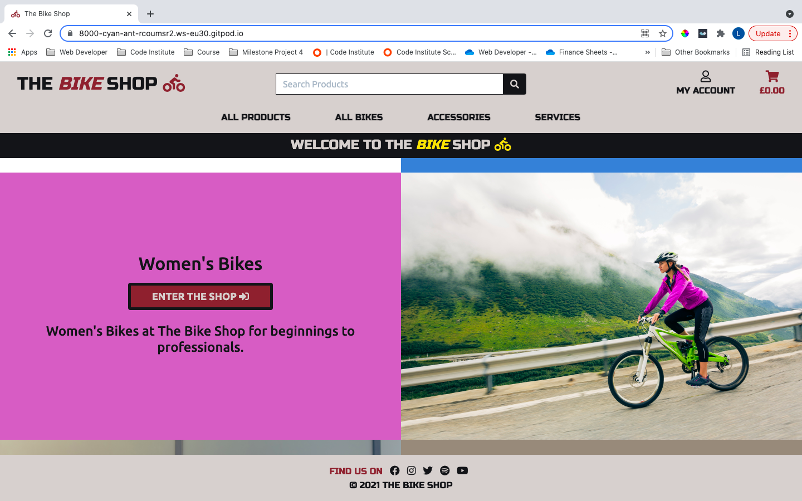
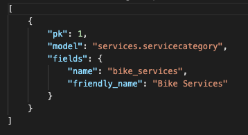
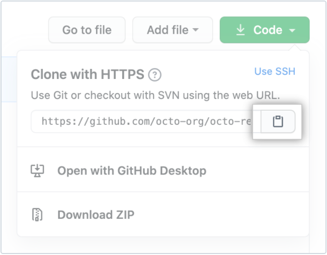

# The Bike Shop

## Code Institute - Milestone Project 4

<a href="https://the-bike-shop-project.herokuapp.com/" target="_blank">Click here to view The Bike Shop live</a>

## Table of contents
1. [Introduction](#introduction)
1. [Project Introduction](#project-introduction)
1. [UX Design](#ux-design)
    * [User Demographic](#user-demographic)
    * [Main Aims](#main-aims)
        - [User Goals](#user-goals)
        - [Site Owner Goals](#site-owner-goals)
        - [Developer Aims](#developer-aims)
1. [User Stories](#user-stories)
1. [Development Process](#development-process)
1. [My Strategy](#my-strategy)
    * [General](#general)
    * [Unregistered Users](#unregistered-users)
    * [Registered Users](#registered-users)
    * [Store Owner/Admin](#store-owner-or-admin)
1. [My Design](#my-design)
    * [Hero Images](#hero-images)
    * [Colour Scheme](#colour-scheme)
    * [Typography](#typography)
    * [Imagery](#imagery)
1. [Products and Services](#products-and-services) 
    * [Products](#products) 
    * [Services](#services) 
1. [Wireframes](#wireframes)
1. [Development Environment](#development-environment)
1. [Database Models](#database-models)
    * [Original Database](#original)
    * [Updated Database](#updated)
1. [Features](#features) 
    * [Navbar](#navbar)
        - [Desktop Navbar](#desktop-navbar)
        - [Mobile Navbar](#mobile-navbar)
    * [Registration Page](#registration-page)
    * [Homepage](#homepage)
    * [Footer](#footer)
    * [Products Pages](#products-pages)
    * [Product Detail Page](#product-detail-page)
    * [Shopping Cart Page](#shopping-cart-page)
    * [Checkout Page](#checkout-page)
    * [Order Summary Page](#order-summary-page)
    * [Services Page](#services-page)
    * [Service Detail Page](#service-detail-page)
    * [Service Booking Summary](#service-booking-summary)
    * [Service Booking Page](#service-booking-page)
    * [Service Booking Confirmation Page](#service-booking-confirmation-page)
    * [Toasts](#toasts)
    * [Login Page](#login-page)
    * [Reset Password Page](#reset-password-page) 
    * [Sign Up Page](#sign-up-page)
    * [Profile Page](#profile-page)
    * [Logout Page](#logout-page)
1. [Shop Owner Features](#shop-owner-features)
    * [Add Products](#add-products)
    * [Edit Products](#edit-products)
    * [Delete Products](#delete-products)
    * [Admin Access Only](#Admin-access-only)
1. [Other Features](#other-features)
1. [Future Features](#future-features)
1. [Stripe](#stripe)
1. [Allauth](#allauth)
1. [Crispy Forms](#crispy-forms)
1. [Sending Emails](#sending-emails) to complete
1. [Deployment](#deployment) to complete
    - [Github](#github) to complete
    - [Heroku](#heroku) to complete
    - [AWS](#aws) to complete
1. [Clone Project](#clone-project)
1. [Forking Project](#forking-project)
1. [Technologies Used](#technologies-used)
1. [Testing](#testing) to complete
1. [Credits](#credits)
1. [Acknowledgements](#acknowledgements)
1. [Notes](#notes) to complete
1. [Final Step](#final-step)

[Back to top ⇧](#the-bike-shop)

## Introduction
This Milestone project (Full Stack Frontend Development) is the fourth and final project to contribute towards my Full Stack Web Developer Diploma with Code Institute. 

The main requirements in this project are to design a Full-Stack e-commerce website based around business logic to control a centrally-owned dataset. The site setup includes an authentication mechanism with the option for users to pay for products and book services with a further option to sign up for an account to access orders after a purchase has been made. There also is a site administrator login for the owner of the site to access and give them the option to add new products, edit existing products. delete products and gain access to customer product orders and service bookings with login details giving full management of the site. The main technologies used to achieve complete project is HTML, CSS using the Bootstrap5 framework, JavaScript using the jQuery library, Python using the Full framework, Django (Model Template View - MVT architecture), Relational Databases - MySQL and Postgres, Stripe - payment processing platform and Heroku with Git for deployemnt. 

Django Data Structure - MVT architecture (Model Template View) 

- Model – Represents the data from the database in order for the application to work 

- Template – Presents the layer and defines how information is displayed to the end user 

 - View – Defines the business logic that links the templates to the models 

 [Back to top ⇧](#the-bike-shop)

 ## Project Introduction 

 The Bike Shop is an easy-to-use online shopping experience for cycling lovers to visit and purchase products and book services. Products available to purchase are Men's bikes, Woman's bikes, Urban bikes, Cycling Helmets and general accessories. Before purchasing any product, users can get access to more information about that product with the option to pick a size (if applicable). The services available to book on the site is professional bike cleaning, bike repair and a sell your bike scheme. The user will need to pick a service to book and submit some information for a member of The Bike Shop team to then make contact.  

 Date this project started: 20th December 2021 
 Date this project was deployed: TBC

 ## UX Design

 ### User Demographic

- For adult cyclists only  
- For cycling enthusiasts who want to purchase their first adult bike for enjoyment 
- For cycling enthusiasts who want to purchase their first adult bike for fitness 
- For cyclists that want to upgrade their current bike to something more advanced 
- For cyclists that want to purchase additional accessories for comfort and safety 
- For anyone wanting to start cycling to work  
- For cyclists that need a service like a bike cleanup, repair or the option to sell their bike for whatever reason.  

[Back to top ⇧](#the-bike-shop)

### Main Aims

#### User Goals 

- To view all products and services on the site 
- To search for a product quickly by keyword(s) - To find the right type of bike based on my requirements around cycling 
- To find the right bike accessories for my requirements around cycling 
- Find the right service for my bike i.e., clean, repair and/or sell 
- Sign up to an account to view orders and to make it easier to order in the future 
- To easily login to my account 
- To view previous orders 
- To view saved profile details i.e., contact number and address with the option to update details 
- To add a product(s) of choice to my shopping cart 
- To view my shopping cart before purchase 
- To update and/or remove a product from my shopping cart 
- To complete a purchase using an online card payment system 
- To receive confirmation of order on the site and via email 
- To easily logout of my account 

#### Site Owner Goals 

- ‘Admin’ username and password login 
- Access to 'Product Management’ i.e. orders
- Access to 'Admin Panel' i.e. bookings
- Add a new product  
- Edit a current product 
- Delete a current product 
- Admin access to view, update and/or delete products, services and users 
- **CRUD** conventions realised and achieved 
(Create, Read, Update and Delete)

#### Developer Aims 

- Create an interesting and easy to use e-commerce website for cycling lovers to visit and make purchases 
- Demonstrate the use of front-end and back-end Web development languages recently learnt with Code Institute. 
- The use of relational databases to store product data and user details to easily update, add and delete when required 
- Successful deployment adding to the developer portfolio
- To achieve a final grade to contribute towards the Full Stack Web Developer Diploma overall grade 

[Back to top ⇧](#the-bike-shop)

## User Stories

| **User Story Id** | **User Story Statement - Overall** | **Testing** |
| --- | --- | --- |
| 1 | Regular shopping - I want to be able to view products and services so that I can select and purchase a product or book a service | See [Testing document](TESTING.md) |
| 2 | Regular shopping - I want to be able to view a product or service in detail so that I can be sure that it’s the right product or service I'm looking for | See [Testing document](TESTING.md) |
| 3 | Regular shopping - I want to be able to view what I have placed in my shopping cart so that I can make sure that I spend within my budget set for this product | See [Testing document](TESTING.md) |
| 4 | Regular shopping - I want to be able to search for a specific product without scrolling through all the products so that I can then select an item and make a purchase quicker | See [Testing document](TESTING.md) |
| 5 | Regular shopping - I want to be able to sort products into price order so that I can select the best product for my money and within budget | See [Testing document](TESTING.md) |
| 6 | Regular shopping - I want to be able to sort a specific product based on other users purchasing the product so that I can be confident that I will enjoy the product knowing it's been well received by others | See [Testing document](TESTING.md) |
| 7 | Regular shopping - I want to be able to register an account with a username and password so that I can access my account to make quick purchases whenever I need to | See [Testing document](TESTING.md) |
| 8 | Registered shopping - I want to be able to login and logout of the site by computer or smartphone so that I can access my account with my personal details at any time and know that my details are safe when logging out | See [Testing document](TESTING.md) |
| 9 | Registered shopping - I want to be able to have the option to change my password to my account so that I can continue to gain access if and when I forget my password | See [Testing document](TESTING.md) |
| 10 | Regular shopping - I want to be able to select the right product based on size so that I can get maximum enjoyment from my purchase with the right size for comfort | See [Testing document](TESTING.md) |
| 11 | Registered shopping - I want to be able to Look back at placed orders so that I can check that I have purchased the right product | See [Testing document](TESTING.md) |
| 12 | Regular shopping - I want to be able to access my shopping cart before purchasing so that I can so I can potentially adjust, remove and/or add an item before committing to a purchase | See [Testing document](TESTING.md) |
| 13 | Shop owner - I want to be able to check a user's profile so that I check whether there's any orders outstanding to complete | See [Testing document](TESTING.md) |
| 14 | Shop owner - I want to be able to add a new product so that I can increase my store product range and potentially increase sales | See [Testing document](TESTING.md) |
| 15 | Shop owner - I want to be able to update a product so that I can inform my customers of the most up to date information to maximise sales | See [Testing document](TESTING.md) |
| 16 | Shop owner - I want to be able to delete a product so that I can successfully remove an item that is no longer in stock or for sale | See [Testing document](TESTING.md) |
| 17 | Shop owner - I want to be able to add a new service so that I can increase the service range to increase my customer base | See [Testing document](TESTING.md) |
| 18 | Shop owner - I want to be able to update a service so that I can inform customers of the most up to date information relevant to the service | See [Testing document](TESTING.md) |
| 19 | Shop owner - I want to be able to delete a service so that I can successfully remove a service that is no longer available | See [Testing document](TESTING.md) |
| 20 | Shop owner - I want to be able to access products, services, orders, bookings and user profiles so that I can make it easy to view the store products, services, current orders, bookings and user profiles active | See [Testing document](TESTING.md) |

Click this link to see all <a href="https://github.com/liamwalsh1980/Milestone-Project-4/blob/main/readme/pdf/user-stories-before.pdf" target="_blank">User Stories</a> on pdf. 

## Development Process 

As this project is focused on full stack development and using a relational database with Stripe Payments, more time was given to the preparation of the site based on UX Design, the data for the site whilst keeping a full focus on the user goals, site owner goals, developer goals and user stories. 

## My Strategy 

After looking back over my previous projects, I decided to breakdown my strategy into sections making the development process easier to delivery. This gave me a better understanding of what I needed to include and what would be more important from the point of view of an end user, store owner and the developer of the application.  

### General 

- Logo (desktop only) 
- Search facility 
- Sort facility 
- Navbar list for desktop 
- Hamburger Menu Navbar for mobile and tablet 
- Subscribe option 
- Strong Hero Image on the Homepage 
- Header 
- Enter the Shop button with 'enter' icon
- Shopping cart 

### Unregistered Users
- Need to be able to: 
    - Search for products 
    - View products/services 
    - Use the sort facility  
    - View details of each product/service
    - Buy products as a guest 
    - Book a service as a guest
    - Receive an email confirmation for all purchases made 
    - Obtain an order number or booking number straight away once a product is purchased or a service is booked
    - Register an Account using a username and secure password (optional) 

### Registered Users 
- Need to be able to: 
    - Login with username and password 
    - Search for products 
    - View products/services 
    - Use the sort facility
    - View details of each product/service 
    - Buy products 
    - Book a service 
    - Receive an email confirmation for all purchases made 
    - Obtain an order number or booking number straight away once a product is purchased or a service is booked
    - Access Profile - delivery and contact details 
    - Access Profile - order history (if applicable)
    - Logout 

### Store Owner or Admin
- User needs to be able to: 
    - Login with username and password
    - Search for products 
    - View products/services 
    - Use the sort facility 
    - View details of each product/service 
    - Buy products for testing
    - Book a service for testing
    - Receive an email confirmation for all test purchases made 
    - Obtain an order number or booking number straight away once a product is purchased or a service is booked for testing
    - Access Profile - delivery details 
    - Access Profile - order history (if applicable)
    - Add new Products 
    - Update Products 
    - Delete Products 
    - Add/edit/delete services from the backend of the site in Django Admin
    - Logout
    - Access Django Administration panel

With these goals in mind, I put together diagrams that shows the importance and Viability relevant to each. 

 

[Back to top ⇧](#the-bike-shop)

## My Design 

I wanted this project to have minimum text and therefore it is important to note that I made sure that from the products for sale, services offered, images used, nav links applied, my colour scheme, text styling picked and the name of the site, it is clear what this site offers and who the target audience is.  

### Hero Images 

The hero images came from Shutterstock at a cost of £5.80 per image. I found a few good images that I believe would work well for the homepage. The originally idea which can be seen in my wireframes and below is to use one image with an ’Shop Now' button in the middle. See image below for reference (destop view)

This looked fine; however, I felt the homepage needed more images in sections to represent what the site was about and what target audience I was aiming for. With this in mind I used 4 different images representing the 4 main product categories. 

The sport of cycling is very colourful with Bikes, Clothing, Helmets and Competition Winning Jerseys all represented with bright colouring. With this in mind the first image users will see contains plenty of colour with a male cyclist as the main focus. I then used 3 more images to represent women's bikes, urban bikes and accessories. See images below for reference (desktop view)

Please see the [Credits](#credits) section for information about where the images were sourced from.  

### Colour Scheme

I wanted a strong bright colour to represent the shop well. I used the colours from the accessories Hero image on the homepage to use throughout the site starting with Minion Yellow. I then wanted a contrasting colour like black to compliment this Yellow, therefore I used the same shade of black from the accessories hero image which is called Rich Black. The light grey called Timberwolf was also sourced from the background of this hero image. I then used Coolors.co to extract 2 more colours which sits between Minion Yellow and Timberwolf called Flax and between Timberwolf and Rich Black called Sonic Silver.  

The Bike Shop – Colour Pallet from coolors.co

Once I had finished building the homepage, I wanted the logo and ‘Enter the Shop’ buttons to standout more. Therefore, I decided to add a new colour to achieve this. The colour chosen is a deep red (Antique Ruby). I Also used the next shade across from this colour for hovering over. This shade I chose is called Cordovan red. This is used for the category links on the products and services pages. Both colours sourced from coolors.co like my main palette. 

[Back to top ⇧](#the-bike-shop)

### Typography

I used Google fonts to home in on 2 fonts needed for this project.  

For the logo text I chose the font style – <a href="https://fonts.google.com/specimen/Russo+One" target="_blank">Russo One</a> to give the logo a striking and bold look. This I believe would show users that the site is built with personality and style encouraging them to stay on the site and explore the products and services.  

For the main content of the site, I used a reliable font called <a href="https://fonts.google.com/specimen/Russo+One" target="_blank">Ubuntu</a>. I tested this font with varies product and service titles and made sure it looked good across all font sizes from 8px upwards. 

### Imagery

All products and services have an image to show users what they are buying, I felt it best to keep the background of the site plain white. This works well to clearing show all images. However, I decided to break up this background colour by using the Timberwolf grey from my colour palette in the header and footer of the site.  

I looked at using a ‘bike’ image to replace the word Bike from the logo title. Instead, I simply added a font awesome image of a bike to the end of the text logo. 

Several other font awesome images were used to show Customer Account, Shopping cart, services offered and certain fields within all products I.e., Rating star and product tag.  

I used the noimage.png image in this project in case there was no available image for any product or service that is added to the site. This simply fills a gap to make sure good UX is maintained.  

[Back to top ⇧](#the-bike-shop)

## Products and Services 

With 50 products and 3 service added I wanted to make sure each one was allocated into a relevant category name. I also wanted to make sure that the products had the same format fields for consistency, giving users the same type of useful information for all products. JSON files inside the fixtures folders hold all data for products and services. All product details, images and URLs were sourced manually using the Halfords website - see [Credits](#credits) for more information. 

### Products 

#### Products data (example)

For more information please click this <a href="https://github.com/liamwalsh1980/Milestone-Project-4/blob/main/products/fixtures/products.json" target="_blank">JSON </a>link to see full data used

#### Products categories 

For more information please click this <a href="https://github.com/liamwalsh1980/Milestone-Project-4/blob/main/products/fixtures/categories.json" target="_blank">JSON </a>link to see full data used

### Services 

#### Services data

For more information please click this <a href="https://github.com/liamwalsh1980/Milestone-Project-4/blob/main/services/fixtures/services.json" target="_blank">JSON </a>link to see full data used

#### Services category

For more information please click this <a href="https://github.com/liamwalsh1980/Milestone-Project-4/blob/main/services/fixtures/servicecategories.json" target="_blank">JSON </a>link to see full data used
 
[Back to top ⇧](#the-bike-shop)

## Wireframes 

All Wireframes were designed for laptop/computer, iPad/tablet and mobile display: 

Please click <a href="https://github.com/liamwalsh1980/Milestone-Project-4/blob/main/readme/pdf/The-Bike-Shop-Wireframes.pdf" target="_blank">PDF Wireframes </a> to see wireframes in pdf format

[Back to top ⇧](#the-bike-shop)

## Development Environment 

Within Github I opened a ‘new’ repository and included the Code Institute full template. The New repository is called liamwalsh1980/Milestone-Project-4 with a brief description of the new application which can be seen below: - 

*An online shop for cyclists of all levels to purchase a new bike, accessories and services. The site allows users to create an account with a username and password to access and make purchases easily and quickly.*

I then clicked ‘Gitpod’ to open the workspace up. 

- I started by installing Django in the command line using the command  
**$ pip3 install django**

- Then I create the new product called ‘the-bike-shop' using the following command 
**$ django-admin startproject the_bike_shop .**
(dot is to make sure it’s added to the current directory) 
This creates the new project folder with __init__py, asgi.py, settings.py, urls.py, wsgi.py files with the manage.py at project level.  

- Inside the .gitignore file I added *.sqlite3, to ignore the development database file and *.pyc along with __pycache__ to ignore compiled python code not needed in version control. 

Then I added the following new files: - 

- app.py using the command touch app.py (this will be for writing Python code 
- env.py using the command touch env.py (this will be for hiding sensitive data) 
- .gitignore should already be created based on the CI template installed when creating the repository. Within the file the env.py file should be added along with the __ pycache __ directory that will be auto-generated shortly. 

At this stage I ran the project to make sure all is working so far by using the command 
- **$ python3 manage.py runserver**

Back on the workspace I stopped the server and run initial migrates using the command 
- **$ python3 manage.py migrate**

Then I created a superuser to login as an administrator by using the command 
- **$ python3 manage.py createsuperuser**
    - Username: shopowner
    - Email: lwalsh_1980@hotmail.co.uk
    - Password: **************
    
To finish, I added, committed (initial commit) and pushed the code using the following commands
- **$ git add .** 
- **$ git commit –m "Initial commit”** 
- **$ git push**

[Back to top ⇧](#the-bike-shop)

## Database Models 

### Original

### Updated

There were some adjustments to the models
- Products model doesn't include has_colors which is a feature I would look to introduct in the future
- Order model doesn't include delivery_cost as I decided to keep all deliveries at zero.
- Services model changed from the original plan to show a full working model. 

## Features

### Navbar 

The Navigation menu is displayed across all web pages and across all screen sizes for users to move through the website easily and quickly. It's displayed with a different background colour (Timberwolf grey) to the body of the website. The font styling for text links is the same as the logo (Russo One). 

Just below the navbar menu, users will see a fixed banner welcome message which stays in place across all web pages. I feel this nicely breaks up the navbar and body of each page. The banner stating the website name ‘The Bike Shop’ and is very important to have on smaller screens because the logo has been removed and replaced by the hamburger menu icon for good UX. The banner is also a link back to the homepage and again important to have on smaller screens when the logo is replaced by the hamburger menu icon.

#### Desktop Navbar 

The Navigation menu on desktop screens has a text logo with a bike icon. This can be found at the top left of the navbar. Users can click this logo and it will take them back to the homepage. The word ‘Bike’ and the bike icon changes colour when a user hovers over it giving them an indication that it’s a clickable logo. Users will find a search bar to use to search for products and the following links positions to the right: - 

- User icon (My Account) 
- Shopping cart icon (starts with £0.00) 

Shopowners/Admin users will see additional links when logged in: -

- Product Management (For adding new products)
- Admin Panel (for easy access to the backend Django panel to view, amend and delete orders, bookings and user profiles)

Below the search bar in a horizontal row users can find the following links to click on: - 

Products 
-    By Price 
-    By Rating 
-    By Category 
-    All Products 

Bikes 
-    Mens Bikes 
-    Womens Bikes 
-    Urban Bikes 
-    All Bikes 

Accessories 
-    Helmets 
-    Other Accessories 
-    All Accessories 

Services 
-    Cleaning 
-    Repair 
-    Sell Your Bike 
-    All Services 
-    Go To Booking

[Back to top ⇧](#the-bike-shop)

#### Mobile Navbar 

On mobile and tablet screens, the navigation bar is displayed using the hamburger menu icon in the top left replacing the logo. This is done to give better UX when viewing the site on smaller screens. Users can click the hamburger menu which opens up the same link options as desktop users. The ‘User’ icon (My Account) and ‘Shopping Cart’ icon (Starts with £0.00) remains in place however the search bar is replaced with the ‘Search’ icon for users to click on. When users click the ‘Search’ icon the search bar appears below. 

When users click the hamburger menu icon this changes to a cross which indicates to the user that the menu is open and can be closed by clicking the cross at any point. I decided to use AlpineJS as a tool to achieve this. At this point I also decided to remove the border around the hamburger menu. 

Navigation links on the top right update depending on the user being logged in and whether that user is a regular shopping or administrator.  

### Registration Page 

Users are encouraged to sign up to an account but it’s not mandatory and therefore they can still make purchases without an account. Upon making a purchase users will still receive an email confirmation and immediate notification that their order has been received once they click the ‘Complete Order’ button on the Delivery and Payment page. 

The process to sign up to an account is simple. Click the ‘My Account’ button at the top of the navigation menu which will open a dropdown menu to either ‘Login’ or ‘Sign Up’ Once the ‘Sign Up’ link is clicked the user will need to provide the following: -  

- Username  
    - This can be anything as long as it's not been used already 
    - An error message will appear immediately if the username already exists 

- Email Address  
    - The user will need to add their email address twice for security and avoid any typo mistakes made by mistake

- Password  
    - The user will need to add a password twice for security and to avoid any typo errors made by mistake 

Once this process is complete the user will see notification on the registration page that their account is active and verification is required. At the same time the user will receive an email confirmation to verify their account by clicking a link from within the body of the email. Once verified the user can: -  

- Login using their username and password  
(A password recovery option is available if required)
- Access their personal profile page 
    - Save delivery address and contact information
    - Update delivery address and contact information 
    - View order history (if any) 

Admin User will have additional access to the following: 

- Product Management page
(CRUD – Create, Read, Update Delete achieved) 
    - View current products and services 
    - Add a product 
    - Edit a product 
    - Delete a product
    - Access the Admin Panel page  
        - User accounts 
        - Change user account details and permission level
        - Delete accounts 
        - Edit Accounts
        - Orders received (products)
        - Edit orders
        - Delete orders
        - Bookings received (services)
        - Edit bookings
        - Delete bookings
        - Categories (products)
        - Service categories
        - Add categories
        - Edit categories
        - Delete categories
        - URLs

[Back to top ⇧](#the-bike-shop)

### Homepage

Users will see 4 sections on the homepage with each section split in half. All sections have different background colouring with an image making up one side and a large ‘Enter the Shop’ button with 'enter' icon centred which makes up the other side making it easy for users to click through to the products they are interested in. The 4 sections represent products for sales in regards to mens bikes, women's bikes, urban bikes and accessories.   

One of the last features added before submitting this project was the homepage carousel to perform a slideshow of selected products linking each one to the relevant products section category. I wanted to add a carousel to my MS3 project, however, I didn't get the chance based on the timescales I was working to. The carousel is positioned half way down the homepage with 9 products rotating. Users have the option to speed up the carousel by clicking the right and left chevron. Indicators are positioned at the bottom of the carousel for users to be aware of the product count for good overall UX. I also added a title header at the bottom of each image to give users an idea of what the image is looking at. Users can click on any of the images/headers and they will be taken to the relevant category for that product. 

### Footer 

A footer has been added to the site to show users a nice finish to each page. With good UX in mind users will see that the footer has the same font styling and colouring as the navbar at the top. Users will see social media icons available to click on to take them to a new webpage associated to which ever icon is clicked. All social media icons change colour (Antique Ruby) when hovering over them.

[Back to top ⇧](#the-bike-shop)

### Products Pages

Within all the products pages users can browse through the products, each giving the following: - 

- Products image 
- Product name 
- Price 
- Category tag 
- Rating 

All products have a border around them showing separation from each other.  

The Products available upon deploying the site is as follows: - 

- Men's Bikes 
- Women’s Bikes 
- Urban Bikes 
- Helmets 
- Other Accessories 

Users can also sort by: - 

- Price 
- Rating 
- Category 

The ‘Products > By Price’ page contains a subheader below the banner along with an indication of how many products are on this page and a small text link to go back to the All Products page if required. This page sorts all products by Price order starting with lowest price products first.  

The ‘Products > By Rating’ page contains a subheader below the banner along with an indication of how many products are on this page and a small text link to go back to the All Products page if required. This page sorts all products by Rating order starting with highest rating products first. 

The ‘Products > By Category’ page contains a subheader below the banner along with an indication of how many products are on this page and a small text link to go back to the All Products page if required. This page sorts all products by Category order, alphabetically. 

The ‘Products > All Products’ page contains a subheader below the banner along with an indication of how many products are on this page. This page is not sorted in anyway however, like on all Product pages, users will see on the right side near the top a ‘sort’ feature where users can sort by price, rating, name and category either by ascending or descending order. 

The ‘Bikes > Mens Bikes’ page contains a subheader below the banner along with an indication of how many products are on this page and a small text link to go back to the All Products page if required. This page shows just Mens Bikes with the option on the right side near the top a ‘sort’ feature where users can sort Mens Bikes by price, rating, name and category by ascending or descending order. 

The ‘Bikes > Womens Bikes’ page contains a subheader below the banner along with an indication of how many products are on this page and a small text link to go back to the All Products page if required. This page shows just Womens Bikes with the option on the right side near the top a ‘sort’ feature where users can sort Womens Bikes by price, rating, name and category by ascending or descending order. 

The ‘Bikes > Urban Bikes’ page contains a subheader below the banner along with an indication of how many products are on this page and a small text link to go back to the All Products page if required. This page shows just Urban Bikes with the option on the right side near the top a ‘sort’ feature where users can sort Urban Bikes by price, rating, name and category by ascending or descending order. 

The ‘Bikes > All Bikes’ page contains a subheader below the banner along with an indication of how many products are on this page and a small text link to go back to the All Products page if required. Below the subheader users will see small badges which are links to other options within this category. This page shows All Bikes with the option on the right side near the top a ‘sort’ feature where users can sort All Bikes by price, rating, name and category by ascending or descending order. 

The ‘Accessories > Helmets’ page contains a subheader below the banner along with an indication of how many products are on this page and a small text link to go back to the All Products page if required. This page shows just Helmets with the option on the right side near the top a ‘sort’ feature where users can sort Helmets by price, rating, name and category by ascending or descending order. 

The ‘Accessories > Other Accessories page contains a subheader below the banner along with an indication of how many products are on this page and a small text link to go back to the All Products page if required. This page shows just Other Accessories with the option on the right side near the top a ‘sort’ feature where users can sort Other Accessories by price, rating, name and category by ascending or descending order. 

The ‘Accessories > All Accessories’ page contains a subheader below the banner along with an indication of how many products are on this page and a small text link to go back to the All Products page if required. Below the subheader users will see small badges which are links to other options within this category. This page shows All Accessories with the option on the right side near the top a ‘sort’ feature where users can sort All Accessories by price, rating, name and category by ascending or descending order. 

Users can add the product to their shopping cart directly on this page by selecting the following: -  

- Size - if applicable, a size must be selected 
- Quantity - any quantity between 1 and 20 will need to be selected, otherwise the user will see an error message and the item(s) won’t be added to the user's cart until a quantity between 1 and 20 is selected. 

If a user is interested in a product but want more information before purchasing, they can click on that product which takes them to the Product page giving them more details and the option to add to their basket.  

At the right side, bottom of every products page, users can click the ‘back to top’ cursor which is an up arrow in a small round background. Clicking this will bring users to the top of the page the user is on. 

[Back to top ⇧](#the-bike-shop)

### Product Detail Page

Users can click through to a product detail page for each product showing the user a bigger image to look at and more details about the product chosen. Users will know quickly what product detail page they are on as the product name is displayed as a header at the top above the image. Users can also click the image again which opens up a new web page tab showing just the image with black background. 

Users will see the Product Name, Price, Category (link to go to all products within that category), customer rating out of 5.0 and a product description. 

Users can add the product to their shopping cart by selecting the following: -  

- Size - if applicable, a size must be selected 
- Quantity - any quantity between 1 and 20 will need to be selected, otherwise the user will see an error message and the item(s) won’t be added to the user's cart until a quantity between 1 and 20 is selected.  

Once a user selects a size (if applicable) and quantity, they can then click the ‘add to cart’ button.  

If a user changes their mind, they can click the ‘Go Back’ link taking them back to the products page within the specific product category.  

### Shopping Cart Page  

Users can access their cart at any point by clicking the ‘cart’ icon at the top right on any page. If a user clicks this when they have no products in the cart, they will be taken to an empty shopping cart page and they will see a message with a ‘sad’ face icon and a ‘Shop Now’ button below to click on. This will take them back to the products page to start shopping.  

If a user has at least 1 product in their shopping cart they will see the following when they click their cart.  

- Product Image 
- Product Information with size if applicable 
- Price of the product 
- Qty (Quantity) which includes a decrease/increase option and text links to ‘Update Qty’ or ‘Remove All’. Clicking the ‘Update Qty’ link will update the shopping cart, subtotal and the top right value of the shopping cart in the navigation menu. Clicking the ‘Remove All’ link will simply remove the product from the shopping cart and take the user to the empty shopping cart page 
- Subtotal which is the product price times the quantity selected.  
- Grand total which will be no different than the Subtotal as they delivery charge is free at The Bike Shop.  
- ‘Keep Shopping’ text link which takes user back to the products page 
- ‘Secure Checkout’ button which takes the user to a secure payment page to complete their order.  

I decided to added a mobile and desktop version of this page. On mobile the layout is veritcally aligned and on desktop the layout is horizontal. This provided better UX for customers when they are reviewing their shopping cart. 

[Back to top ⇧](#the-bike-shop)

### Checkout Page 

When the user lands on the checkout page, they will see 2 sections. On desktop these sections sit horizontally and on mobile they sit vertically. The first section users will see is the ‘Please fill out the form below to complete your order’ section to complete. It’s a simple form for users to complete their order which includes: - 

- Details 
    - Full Name (Mandatory field) 
    - Email Address (Mandatory field) 
 
- Delivery 
    - Phone Number (Mandatory field) 
    - Street Address 1 (Mandatory field) 
    - Street Address 2 
    - Town or City (Mandatory field) 
    - County 
    - Postal Code  
    - Country (Mandatory field) 
    
If a user is logged in to their account, they have the option to tick/untick the ‘Save this delivery information to my profile’ checkbox. It's checked by default.  

If a user doesn't have an account or isn’t logged in the user will see ‘Create an account or login to save this information’ options to click on.  

- Payment (Stripe Element) 
    - Card Number / MM/YY CVC (Mandatory field) 

If a user types an incorrect card number they will see an error message - 'Your card number is invalid message'

Below this, users will see a ‘Complete Order’ button to click on to complete their purchase with a clear indication below of how much the user's card will be charged. If the user wants to go back to either adjust their shopping cart or change their mind on buying altogether, they can click the ‘Adjust Cart’ text link which sits to the left of the ‘Complete Order’ button

The next section called ‘Order Summary - Your Shopping Cart Has (?) products’ is for users to view what is in their shopping cart before they place their order.  

On this page users will be notified immediately if they haven’t completed the form properly as most of this page has mandatory fields that need information adding to complete an order. 

Further authentication - Users will notice that when they have completed the order form and clicked the ‘Complete Order’ there is a short delay while their payment goes through. They will see light green background overlay and a loading spinner showing their order is going through the process payment. They are then given the option of completing their purchase or cancelling it. If they cancel the order the user is taken back to the order ‘Checkout’ page where all their details remain in place and a ‘red’ notice warning at the bottom saying ‘We are unable to authenticate your payment method. Please choose a different payment method and try again’. If the user clicks to proceed with their purchase, they will see the light green background overlay and the loading spinner again. 

[Back to top ⇧](#the-bike-shop)

### Order Summary Page  

Once the checkout page with the customer payment is completed the user will be taken to an order summary page. On this page users will see a full breakdown of their order giving them the following: - 

- Order Info (Unique Order Number and Order Date and Time) 
- Order details (Products ordered with size confirmed if applicable) 
- Delivering to (Full Name, Address, Phone Number) 
- Billing info (Order total and Grand total) 

Below, users will see a ‘Shop Again’ button to take them back to the products page to shop again if they choose to.  

Users will be notified that an email confirmation has been sent and a 'Thank you’ as the header at the top of the page.  

Users will also see a popup success toast message confirming their order is successfully processed, what their unique order number is and that they will receive an email. This message closes automatically after 10 seconds like all the toasts on the site do.  

Once an order is complete the shop owner can access the details of the order by logging into Django admin panel at the backend of the site under 'Orders'.

### Services Page

The final option on the main navigation bar is the 'Services' option. Selecting this will show the user a dropdown menu to pick from: -

- Cleaning
- Repair
- Sell Your Bike
- All Services
- Go To Booking

Users can browse across 'All Services' The Bike Shop offers in this page. This page has a sub-header clearing stating what page it is. At this moment in time users will see 3 different services available with a clear image and name of what those services are. They all have the category tag and a rating with the option to click 'More Info' which takes users to the Service Detail Page relevant to the service selected. By clicking the image of that service, this will also take users to the Service Detail page. If a user already has a service pending to book, they can click the 'GO TO BOOKING' button to progress their booking. If they click this button without a service pending the user will see a short message confirming that no service has been booked and a 'BOOK A SERVICE' button to click on. All services are boxed individually showing clear separation from each other for better UX. 

### Service Detail Page

Once a user clicks a service they will be taken to that service detail page where the sub-header changes to the relevant service name showing the user what page they are on. This page offers the following: -

- Large image of the service
- Service name
- Tag category
- Rating
- Description
- 'GO BACK' button if the user changes their mind
- 'ADD TO BOOKING' button to add service as a pending booking (When clicking this button a toast popup message displays to confirm the service has been added successfully)
- 'GO TO BOOKING' button to progress order of the booking added

### Service Booking Summary

When the user clicks the 'GO TO BOOKING' they are taken a booking summary page to confirm what service they have pending to book. This page then gives the user the option to click the 'COMPLETE BOOKING' button taking them to the booking form page to complete the booking. 

### Service Booking Page

On this page users will need to provide their full name, email address and phone number to complete the booking process. They also have the option to complete the 'More Information' text box if they want to highlight anything about the booking. Once they click the 'BOOK' button below the booking is generated with a random and unique booking number. 

### Service Booking Success 

Once the booking is completed the user will be taken to a booking success page with a sub-header saying 'THANK YOU'. Underneath the user will see the booking number and confirmation that this has been sent to their email address and a message to say that a member of The Bike Shop will be in contact. To finish the user can click the 'ENTER THE SHOP' button encouraging them to have a look at the products available in the shop. 

Booking a service is a little different to buying a product. Booking a service doesn't cost anything and therefore the process for users is straight forward. Click the service you want, review it,  complete a contact form, receive a booking order number and await contact from The Bike Shop. 

One feature added is that users can only select one service at a time to make it clear what they are booking. If a user has a service pending to book and changes their mind and picks another service, this would mean that the original service will be removed and replaced with the latest service selected. 

All the users information with the booking number will be available for the shop owner to see in the admin panel at the backend of the site under 'Bookings'

[Back to top ⇧](#the-bike-shop)

### Toasts 

There are Bootstrap Toasts displayed under the navbar, providing users with real-time feedback on their actions.  

‘Success’ toasts are represented with a green colour border and displayed for users when they do the following: - 

- Add a product to their cart  
- Update a product quantity 
- Remove a product from their cart 
- Login
- Logout
- Signup
- Complete an order
- Service added

Users will see a toast message pop up confirming the following information: - 

- A relevant message of whether the user has added, updated or removed a product 
- Confirmation of how many products is in the shopping cart 
- A list of products including an image, product name, Quantity and Size (if applicable) 
- A ‘Go to secure checkout’ button or ‘Shop Now’ button if the shopping cart is empty. 

‘Error’ toasts are represented with a red colour border and displayed for users when they do the following: - 

- Attempting to delete a product from the sit, an error will occur.  

Other success toasts are also in place.  

- ‘Warning’ represented with a yellow colour border 
- ‘Info’ represented with an aqua colour border. This toast has the ‘Warning!’ text for reference.  

All toasts include a cross icon in the top right for user to click on to close the toast. Alternatively, after 10 seconds the toast will automatically close. 

When users select a service to book a success toast will popup confirming which service has been selected with the option to confirm the booking in the form a button saying 'GO TO SERVICES'. Users will also see this button when they first sign in and logout encouraging them to go to the Services section to make a booking. I did this as a form of promoting 'Services' as most of the website is based on the Products section. 

[Back to top ⇧](#the-bike-shop)

### Login Page 

When users want to login to their profile this is simple to do. Users can click the 'My Account' icon found on the top right of every page where they will have the option to 'Login' or 'Signup' When clicking the login option users will be greeted with a Login page. 

- On this page and before logging in users can select the checkbox 'Remember Me' which saves the username making it easier to login next time. 
- The user can login in using their username or email address of preferred. The password must be correct in line with the password the user chose when they signed up. 
- If the user gives an incorrect username/email address and/or password they will see an error message - 'The username and/or password you specified are not correct'. This message is vague for security reasons to avoid unauthorised access to a users account. 
- Users can choose to click the 'Home' button to go back to the homepage instead of logging in to their account or of they can't remember their password they can click the 'Forgot Password' to reset which will take them to another page to complete the reset process.
- If an unregistered user finds themselves on this page they can click the 'Sign Up' link to take them to the relevant page to open a new profile account.

### Reset Password Page 

Users can reset their password if they have an account by entering their email address that is connected to their profile account. Once this is done users will receive confirmation that an email has been sent to them in order to reset their password on their account securely. If users change their mind they can select the 'Back to Login' option. 

### Sign Up Page 

Users can Sign Up for a free profile account at anytime by selecting the 'Sign Up'. Users will need to provide the following:- 
- Email address
- Username
- Password

If a user attempts to sign up with an email address thats already connected to a profile they will see an error message - "A user with that username already exists."

If an registered user finds themselves on this page they can click the 'Login' link to take them to the relevant page to sign in. 

Users can choose to click the 'Home' button to go back to the homepage instead of signing up to a new profile account.

[Back to top ⇧](#the-bike-shop)

### Profile Page 

Users will see 2 sections on this page, 'Default Delivery Information' and 'Order History'.
- Default Delivery Information is there to show the user what contact details and address information is currently stored on their profile account. Users can update this by completing the form and selecting the 'Update Information' button. Once this is done the new details will be stored on their profile account making it easier to purchase in the future. 
- Order History will only show information about orders completed. If a user hasn't purchased from the site before this section will be blank. If the user has purchased before they will see details
    - Order Number, which is shown as a shorted number and when the user hovers over this it will show the full order number for reference. The user can also click this order number to take them to the full order details for that particular order. See [Order Summary Page](#order-summary-page) for details on this as this is the same page just with a different toast to confirm to the user its a past confirmation order.
    - Date, showing the date and time the order was placed
    - Items, description and quanity of the product(s) ordered
    - Order Total, which is the amount total paid for that order
 
### Logout Page

Users can logout of their account at anytime by clicking 'My Account' and the 'Logout' option at the top right on any page. 
When users click this option they will be greeted with a Logout page asking them if they are sure they want to logout. The header is 'Sign Out' and the user can then click 'Sign Out' to logout or click 'Keep Shopping' which means they will stay logged in as they continue to shop on the site. 

[Back to top ⇧](#the-bike-shop)

## Shop Owner Features

Shop owners/administrators with superuser access can login to the admin backend and also access the ‘Product Management’ page at the frontend of the site. Once logged in and with the right level of access, the backend admin is available via the URL (URLADDRESS/admin) or more conveniently by clicking the 'Admin Panel' link found within the 'My Account' at the top right. Users will be able to view, edit, delete and add the following: -
- Products
- Product categories
- Orders
- Services
- Service categories
- Bookngs
- User accounts 
- Email address 
- Sites
 
These users can access the product management at the frontend by clicking ‘My Account’ from the top right of any page they are on. Users will be able to view, edit, delete and add Products.

### Add Products

Clicking the 'Product Management' option will take users to the ‘Add a Product’ page to give them the option to add a new product by adding/selecting the following: - 

Category from a dropdown list (mandatory) 
Name (mandatory) 
Description (mandatory) 
Size (yes/no/unknown) 
Price (mandatory) 
Rating 
Image URL or Upload an image 
 
If the form is completed without the mandatory information added or with incorrect information i.e., the wrong price format for example, the user will see an error popup (Failed to add product. Please ensure the form is valid) and a specific error based on what the user did wrong. i.e., for the pricing it would be (Ensure that there are no more than 6 digits in total.) 

If the information is completed correctly the user will see a success message popup confirming the product has been added and then taken to the product detail page of that product just added to show its available on the site. If the user adds a new product without an image, the default ‘noimage’ will be added to cover the space.  

### Edit Products

With every product there is the option to edit (blue text) and delete (red text) that product. By clicking the edit link the user will be taken to a page where the current information is shown. This information can be updated by overriding the current information and clicking update. If the user changes their mind they can click the cancel button at the bottom next to the update button returning them to the product page. A popup alert is also generated when the user first lands on this page and a success message popup when the product has been successfully updated taking the user back to the product page to see the updated information. 

### Delete Products

Shop owners/administrators with superuser access can delete any product by clicking the 'delete' which can be found next to 'edit' for every product. This is instant though and with warning to the user. Once the delete option is clicked the product is removed from the site and the database. 

### Admin Access Only

I have put some security together on these functions within the add_product, edit_product and delete_product views in views.py found within the product app. I used a @login_required decorator to wrap around all three of these views to check the user before executing and also added if statements to check that only superusers can access these sections of the site and if any other user attempts to access via the URL they will be informed via a popup error message that only store owners have access. 

[Back to top ⇧](#the-bike-shop)

## Other Features

Within the head element I added a head icon that is positioned in the tab of the browser when the web page is open. The icon is the same as the ‘bike’ icon to the right of the text logo on the website. The icon was sourced from <a href="https://gauger.io/fonticon/" target="_blank">Gauger - Fonticon</a>.

## Future Features

- Product colours for users to pick alternative colours. In order for this to work I would need to add more images of the products in different colours so that when a colour is picked the image changes to that relevant colour.  

- Wishlist with heart icon 

- Creating more services for customers to pick

- The option for customers to book a service with a date/time to book which would be connected to the shop owners diary

- The option for customers to book a service and purchase a product at he same time as one transaction. 

[Back to top ⇧](#the-bike-shop)

## Stripe 

Stripe offers software APIs to accept payments, send payments and manage all business transactions online with complete security. I setup an account with Stripe using my own email address to use the accept payments option. The option used is called Stripe Elements to add a prebuilt credit card input to my form on the checkout page.  

I then installed Stripe using the command: - 

- **$ pip3 install stripe**

Exporting the public key in version control using the command: - 

- **$ export STRIPE_PUBLIC_KEY=[*KEY*]**

Exporting the secret key in version control using the command: - 

- **$ export STRIPE_SECRET_KEY=[*KEY*]**

As this won’t permanently export, I added both keys to my gitpod main workspace page by going to settings > variables > new variable. 

I then created a ‘paymentIntent’ using Stripe to test that the cart total is coming through by using the python print function to show the total in the terminal.  

I then added a listener to the payment form submit event and used the code from Stripe Docs to do this and with a few adjustments: -  

- Disable the card element to prevent multiple submissions 
- Disable the submit button to prevent multiple submissions 
- Delete the billing details  
- Change some of the syntax to camelCase for best practice 
- Provide the card to stripe and then execute this function on the result 
- Place the error into the card error div 
- Complete indentation 

Then I tested the form using the default credit card number provided by stripe to make sure the ‘paymentIntent’ is successful.  

After completing some code logic in views.py I then created a checkout success template which mirrors the format of the checkout.html. This template takes the order number and renders a success page letting users know their payment is completed successfully.  

‘If’ statements were added to the checkout success template for the street address2, county and postcode as these fields aren’t mandatory for users to complete and will only be displayed in the order summary if they user completes them.  

The logic is set so that when an order is completed by a user their products in the shopping cart will be deleted.  

I then added some redundancy in case a user closes the browser window after a payment is confirmed but before the form is fully submitted and the payment is taken but the order isn't received by the shop owner. I used Stripe webhooks signals to help prevent this.  

Also exported and added to the gitpod main workspace as a new variable is the STRIPE_WH_SECRET 

- **$ export STRIPE_SECRET_KEY=[*KEY*]**

To ensure orders are entered into the database even in the event of a user error during the checkout process, I made sure that customer information was passed through a Stripe payment intent as metadata. This tested by printing the intent to the terminal.  

I then made some changes to the model by adding a couple of new fields to stop a user from creating identical orders in error. The first is a text field that will contain the original shopping cart that created it. The other is a character field that will contain the stripe payment intent ID which is guaranteed to be unique. Once this is done, I then migrated these changes using the makemigrations (with dry run) and migrate (with plan). I then added these fields to the admin side to finish.  

After finishing up the code I then tested that Stripe payments work by adding an order to the shopping cart and then making a purchase using Stripes test credit card number. Tested was completed after being taken to the ‘Order Summary page’, seeing the success toast, checking Stripe webhooks and going into the admin. 

I also added django-countries to gain access to the pre-built country field containing all the valid country codes i.e., GB using the following command and then used the freeze requirements command to bring it all up to date.  

- **$ pip3 install django-countries**
- **$ pip3 freeze > requirements.txt**

[Back to top ⇧](#the-bike-shop)

## Allauth 

Allauth setup – this gives the users the ability to login, log out and sign up for an account. This saves times as the functionalities are already built using Allauth instead of building from scratch. To use Allauth I started by installing it using the command

- **$ pip3 install django-allauth==0.41.0**

Inside settings.py at the top I then imported os using the command   

- **$ import os (set our default environment)**

Then from the django allauth documentation I added AUTHENTICATION_BACKENDS and added to the INSTALLED_APPS 

- django.contrib.sites 
- allauth 
- allauth.account 
- allauth.socialaccount 

Then, underneath the AUTHENTICATION_BACKENDS I added  

- SITE_ID = 1 

In urls.py file I added a new path for the allauth urls to the project using 
path(‘accounts’, include(‘allauth.urls’)) and imported ‘include’ above 
This now means the project has all the urls needed for login, logout, password resets etc. 

I then 'run' migrations to update the database as it has new apps now by using the commands 

- **$python3 manage.py migrate**

The run the application and login to the admin user the superuser just created and change the Domain Name and Display Name in the ‘Sites’ area.  

Back in the settings.py file I added EMAIL_BACKEND code below the SITE_ID with a redirect to /success url which isn’t created yet. I then tested it by running the site and adding /accounts/login to the end of the url and then verifying the account by logging into the /admin again and manually ticking verified and primary. When testing again on the /accounts/login url this time the redirect to /success is achieved and at the moment comes up with a 404 error Page not found which is find as /success is created yet.  

At this stage everything is working and there I used the freeze requirements.txt command  

- **$ pip3 freeze > requirements.txt**

(This creates a requirements.txt folder at project level)

To finish Allauth I then setup the templates directory to start front-end code. I used the following commands to complete this. 

- **$ mkdir templates**
- **$ mkdir templates/allauth**

[Back to top ⇧](#the-bike-shop)

## Crispy Forms

Django package called crispy-forms is installed to let me format all the forms using bootstrap styling automatically. 

Inside settings.py at project level Crispy Forms is installed as an app and built-ins added for:

- crispy_forms.templatestags.crispy_forms_tags 
- crispy_forms.templatestags.crispy_forms_field

## Sending Emails

In order to setup real email sending I used my googlemail account as it offers a free SMTP server (Simple Mail Transfer Protocal). The steps taken to set this up is as follows: -

- Login to Gmail account
- Go to 'settings' (top right)
- Select 'Accounts and Import'
- Select 'Other Google Account Settings' (This opens up 'my account')

Next steps in this process is as follows: -

- Select 'Security' (left side)
- Turn on the '2-step verification' found below password
- Select 'Get Started'
- Re-enter password
- Verify via text message 
- Enter code received from text message
- Select 'Turn On'

Next steps in this process is as follows: -

- Go back a page using the left arrow at the top
- Select 'App Passwords'
- Re-enter password

On the App Password screen the process is as follows: -
- Select 'Mail' for the app
- Select 'Other' for device type and type Django
- Click 'GENERATE' to get a 16 digit password to use

## Deployment 

Requirements 
 
### Github 
### Heroku
### AWS 

AWS (Amazon Web Services)

[Back to top ⇧](#the-bike-shop)

## Clone Project  

Click <a href="https://github.com/liamwalsh1980/Milestone-Project-4" target="_blank">here</a> to view the Github Repository

You can clone this repository from GitHub to your local computer to make it easier to fix merge conflicts, add or remove files, and push larger commits. When you clone a repository, you copy the repository from GitHub to your local machine.

Cloning a repository pulls down a full copy of all the repository data that GitHub has at that point in time, including all versions of every file and folder for the project. You can push your changes to the remote repository on GitHub, or pull other people's changes from GitHub.

1. On GitHub, navigate to the main page of the repository.

2. Above the list of files, click  Code.

3. To clone the repository using HTTPS, under "Clone with HTTPS", click 'clipboard'. To clone the repository using an SSH key, including a certificate issued by your organization's SSH certificate authority, click Use SSH, then click 'clipboard'. To clone a repository using GitHub CLI, click Use GitHub CLI, then click 'clipboard'.

4. Open Terminal.

5. Change the current working directory to the location where you want the cloned directory.

6. Type git clone, and then paste the URL you copied earlier.

>$ git clone https://github.com/YOUR-USERNAME/YOUR-REPOSITORY

7. Press Enter to create your local clone.

[Back to top ⇧](#the-bike-shop)

## Forking Project 

By forking the GitHub Repository, you can make a copy of my original repository on your GitHub account to view and/or make changes without affecting the original repository by doing the following: -

1. Log in to GitHub and locate the GitHub Repository
1. At the top of the Repository click the settings option on the menu, locate and click the "Fork" Button which is at the top right of the page.
1. You should now have a copy of the original repository in your GitHub account.

For a more in-depth guide about how to Fork a repo please <a href="https://docs.github.com/en/github/getting-started-with-github/fork-a-repo" target="_blank">click here</a>.
 
## Technologies Used

* <a href="https://en.wikipedia.org/wiki/HTML" target="_blank">HTML5</a> 
* <a href="https://en.wikipedia.org/wiki/CSS" target="_blank">CSS3</a>
* <a href="https://en.wikipedia.org/wiki/JavaScript" target="_blank">JavaScript</a> 
* <a href="https://en.wikipedia.org/wiki/Python_(programming_language)" target="_blank">Python3</a> 
* <a href="https://www.djangoproject.com/" target="_blank">Django</a> 
    - <a href="https://django-allauth.readthedocs.io/en/latest/index.html" target="_blank">Django AllAuth</a> 
    - <a href="https://django-crispy-forms.readthedocs.io/en/latest/" target="_blank">Django Crispy Forms</a> 
    - <a href="https://pillow.readthedocs.io/en/stable/" target="_blank">Pillow</a> 
    - <a href="https://pypi.org/project/django-countries/" target="_blank">Django Countries</a> 
* <a href="https://www.heroku.com/" target="_blank">Heroku</a> 
* <a href="https://www.heroku.com/postgres" target="_blank">Heroku Postgres</a> 
* <a href="https://www.sqlite.org/index.html" target="_blank">SQLite</a> 
* <a href="https://en.wikipedia.org/wiki/Amazon_S3" target="_blank">AWS S3</a>
* <a href="https://stripe.com/gb" target="_blank">Stripe</a>
* <a href="https://getbootstrap.com/" target="_blank">Bootstrap 4.0</a>
* <a href="https://en.wikipedia.org/wiki/JQuery" target="_blank">JQuery</a>
* <a href="https://fonts.google.com/" target="_blank">Google Fonts</a>
* <a href="https://fontawesome.com/" target="_blank">Font Awesome</a>
* <a href="https://developer.chrome.com/docs/devtools/" target="_blank">Chrome Developer Tools</a>
* <a href="https://github.com/" target="_blank">Github</a>
* <a href="https://en.wikipedia.org/wiki/Git" target="_blank">Git</a>
* <a href="https://gitpod.io/" target="_blank">Gitpod</a>
* <a href="https://balsamiq.com/" target="_blank">Balsamiq</a>
* <a href="https://gauger.io/fonticon/" target="_blank">Font Icon</a>
* <a href="https://jsonformatter.curiousconcept.com/" target="_blank">JSON Formatter</a>
* <a href="https://slack.com/intl/en-gb/" target="_blank">Slack</a>
* <a href="https://www.shutterstock.com/" target="_blank">Shutterstock</a>
* <a href="https://validator.w3.org/" target="_blank">W3C Markup Validation Service</a>
* <a href="https://jigsaw.w3.org/css-validator/" target="_blank">W3C CSS Validation Service</a>
* <a href="https://jshint.com/" target="_blank">JS Hint</a>
* <a href="http://pep8online.com/" target="_blank">Python PEP8 Online</a>
* <a href="https://www.emailjs.com/" target="_blank">Email JS</a>
* <a href="https://cdnjs.com/" target="_blank">cdnjs</a>
* <a href="http://ami.responsivedesign.is/#" target="_blank">Am I Responsive</a> 
* <a href="https://en.wikipedia.org/wiki/Jinja_(template_engine)" target="_blank">Jinja</a>
* <a href="https://codeinstitute.net/" target="_blank">Code Institute</a>

[Back to top ⇧](#the-bike-shop)

## Testing
- Testing information can be found in a separate 
[Testing document](TESTING.md)

### Credits 

- Homepage Images

    - The ‘mens bikes’ <a href="https://www.shutterstock.com/image-photo/young-man-putting-on-helmet-group-1957292200" target="_blank">Image</a> by Photographer <a href="https://www.shutterstock.com/g/ljupco" target="_blank">Ljupco Smokovski</a>

    - The 'women's bikes’ <a href="https://www.shutterstock.com/image-photo/young-woman-cycling-555469123" target="_blank">Image</a> by Photographer <a href="https://www.shutterstock.com/g/nullplus" target="_blank">Nullplus</a>

    - The 'urban bikes’ <a href="https://www.shutterstock.com/image-photo/full-length-portrait-handsome-young-afro-443081008 " target="_blank">Image</a> by Photographer <a href="https://www.shutterstock.com/g/georgerudy" target="_blank">George Rudy</a>

    - The 'accessories <a href="https://www.shutterstock.com/image-photo/bicycle-cycling-accessories-1027172386" target="_blank">Image</a> by Photographer <a href="https://www.shutterstock.com/g/I+am+Kulz " target="_blank">I am Kulz</a>

- Products, Services and content 

    - Most of the sites products images, services image and content came from the popular retailer, Halfords. 
        - <a href="https://halfords.com/bikes/" target="_blank">Products</a>
        - <a href="https://www.halfords.com/bikes/cyclecare/" target="_blank">Services</a> 
        - <a href="https://halfords.com/" target="_blank">Content</a> 

- Code 
    - Boutique Ado project along with my extensive notes was a big help throughout this project.  

[Back to top ⇧](#the-bike-shop)

## Acknowledgements 

- The Slack Community
- Tutor Support
- My family for taking the time to visit my site and give me feedback
- My wife and Son for supporting me throughout the whole course

## Notes 

- DEBUG = False 
- Aria-label
- Screen readers

## Final Step 
 
**End of README Documentation**

[Back to top ⇧](#the-bike-shop)