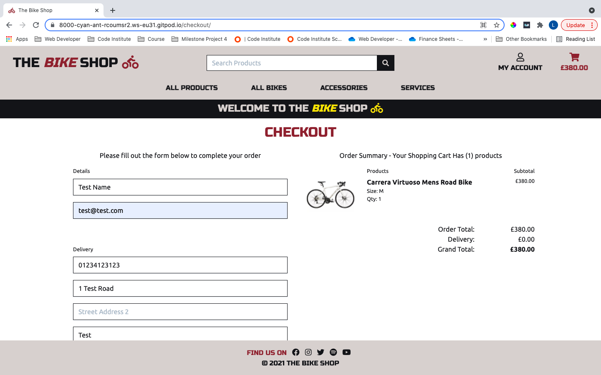
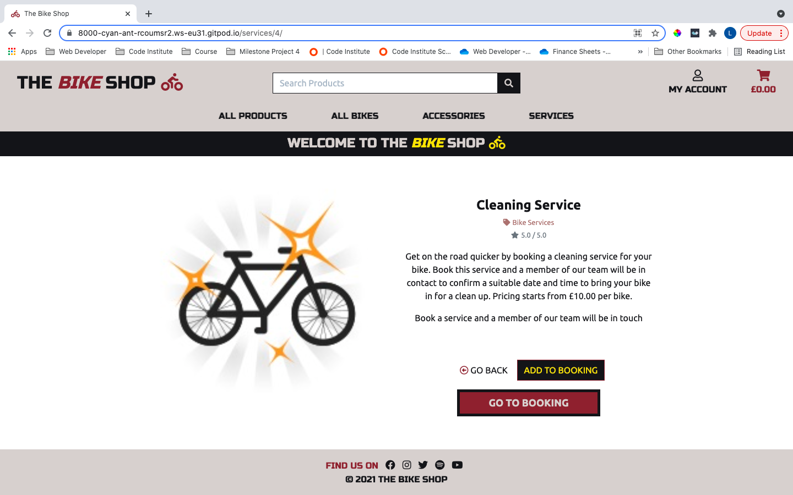
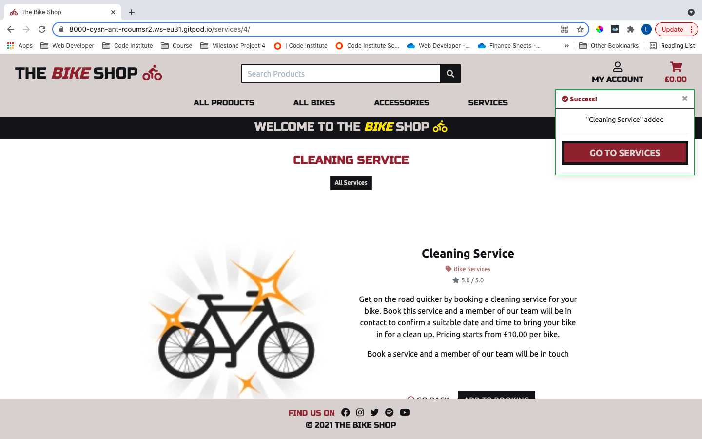
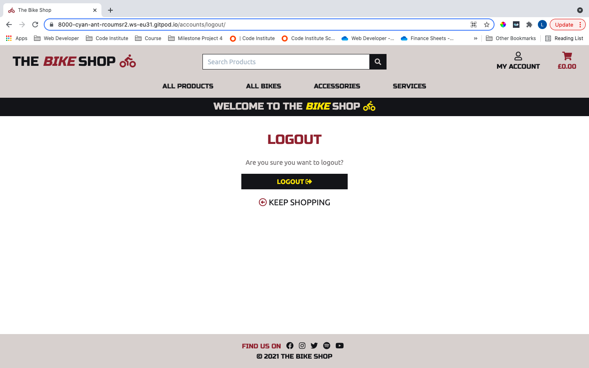
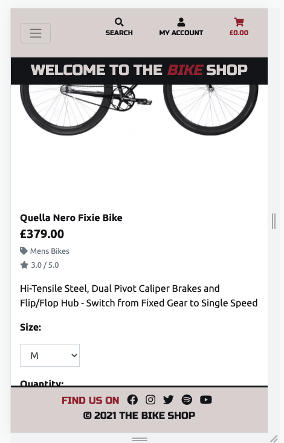

# The Bike Shop

## Code Institute - Milestone Project 4 (Testing)

<a href="https://the-bike-shop-project.herokuapp.com/" target="_blank">Click here to view The Bike Shop live</a>

## Table of contents

1. [Automated Testing](#automated-testing)
    * [Django Testing](#django-testing)
        - Book App
        - Cart App
        - Checkout App
        - Complete App
        - Home App
        - Products App
        - Profiles App
        - Services App
    * [W3C Markup Validation Service](#w3c-markup-validation-service)
        - [HTML templates](#html-templates)
    * [W3C CSS Validation Service](#w3c-css-calidation-service)
        - [Base](#base)
        - [Checkout](#checkout)
        - [Profile](#profile)
    * [JS Hint Javascript code validator](#js-hint-javascript-code-validator) 
        - [JS Files](#js-files)
        - [Scripts](#scripts)
        - [Other Scripts](#other-scripts)
    * [PEP8 online validator](#pep8-online-validator)
        - [Book App](#book-app)
        - [Cart App](#cart-app)
        - [Checkout App](#checkout-app)
        - [Complete App](#complete-app)
        - [Home App](#home-app)
        - [Products App](#products-app)
        - [Profiles App](#profiles-app)
        - [Services App](#services-app)
        - [The Bike Shop App](#The-bike-shop-app)
        - [Project Level](#project-level)
1. [Manual Testing](#manual-testing)
    * [Screen sizes](#screen-sizes)
        - [Mobile screens](#mobile-screens)
        - [Tablet screens](#tablet-screens)
        - [Desktop screens](#desktop-screens)
    * [Navigation bar menu](#navigation-bar-menu)
        - [Hamburger navigation bar](#hamburger-navigation-bar)
        - [Full screen navigation bar](#full-screen-navigation-bar)
    * [User Stories Complete](#user-stories-complete)
    * [Web Browsers](#web-browsers)
        - [Google Chrome](#google-chrome)
        - [Apple Safari](#apple-safari)
        - [Microsoft Edge](#microsoft-edge)
        - [Mozilla Firefox](#mozilla-firefox)
    * [Responsiveness](#responsiveness)
        - [Mobile](#mobile)
        - [Tablet](#tablet)
        - [Desktop](#desktop)
    * [User Functions](#user-functions) 
        - [Purchasing a product](#purchasing-a-product)
        - [Booking a service](#booking-a-service)
        - [Signup](#signup)
        - [Login](#login)
        - [Logout](#logout)
        - Access profile
            - Update information
            - View previous orders
    * [Admin Functions](#admin-functions)
        - [Add a product](#add-a-product)
        - [Edit a product](#edit-a-product)
        - Delete a product
        - Admin Panel
            - View orders
            - View bookings
            - View profiles
            - Update orders
            - Update bookings
            - Delete orders
            - Delete bookings
            - Delete users
    * [Bugs](#bugs) to complete
    * [Bugs Outstanding](#bugs-outstanding) to complete
    
Return to my [README Doc](README.md) 

## Automated Testing

### Django Testing

Automated Unit Testing was done using Django’s testing tools by importing the inbuild TestCase class from Django.

#### **Book App**

#### **Cart App**

#### **Checkout App**

#### **Complete App**

#### **Home App**

#### **Products App**

#### **Profiles App**

#### **Services App** 

### W3C Markup Validation Service

I used <a href="https://validator.w3.org/" target="_blank"> W3 validator</a> to check the html templates for this project. All Errors found were based on rendering added and the base template holding the boilerplate. 

Errors found: -
- Non-space characters found without seeing a doctype first. Expected DOCTYPE html.
- Element head is missing a required instance of child element title.
- Stray doctype. Stray start tag html
- Cannot recover after last error. Any further errors will be ignored.
- Consider adding a lang attribute to the html start tag to declare the language of this document.
- Bad value  for attribute action on element form: Illegal character in path segment: { is not allowed.
- Bad value  for attribute href on element a: Illegal character in path segment: { is not allowed.
- Bad value {{ MEDIA_URL }}noimage.jpg for attribute src on element img: Illegal character in path segment: { is not allowed.
- Misplaced non-space characters inside a table. 
- Misplaced non-space characters inside a table. 

### W3C CSS Validation Service

I used <a href="https://jigsaw.w3.org/css-validator/" target="_blank">W3C jigsaw validator</a> to check the 3 CSS files used for this project. Results below show that there are no erros. 

#### **Base**

#### **Checkout**

#### **Profile**

### JS Hint Javascript code validator

#### **JS files**

I used <a href="https://jshint.com/" target="_blank">JS Hint</a> to check the Javascript files in this project. The following files were checked with no errors founds: -

- checkout app - <a href="https://github.com/liamwalsh1980/Milestone-Project-4/blob/main/checkout/static/checkout/js/stripe_elements.js" target="_blank">stripe.element.js</a>

- profile app - <a href="https://github.com/liamwalsh1980/Milestone-Project-4/blob/main/profiles/static/profiles/js/countryfield.js" target="_blank">countryfield.js</a>

#### **Scripts**

Scripts added within HTML files

- cart app > cart.html - <a href="https://github.com/liamwalsh1980/Milestone-Project-4/blob/main/cart/templates/cart/cart.html" target="_blank">script</a>

- products app > add_product.html - <a href="https://github.com/liamwalsh1980/Milestone-Project-4/blob/main/products/templates/products/add_product.html" target="_blank">script</a>

- products app > edit_product.html - <a href="https://github.com/liamwalsh1980/Milestone-Project-4/blob/main/products/templates/products/edit_product.html" target="_blank">script</a>

- products app > products.html - <a href="https://github.com/liamwalsh1980/Milestone-Project-4/blob/main/products/templates/products/products.html" target="_blank">script</a>

#### **Other Scripts**

- products app > quantity input script - <a href="https://github.com/liamwalsh1980/Milestone-Project-4/blob/main/products/templates/products/includes/quantity_input_script.html" target="_blank">script</a>

- products app > quantity input script cart - <a href="https://github.com/liamwalsh1980/Milestone-Project-4/blob/main/products/templates/products/includes/quantity_input_script_cart.html" target="_blank">script</a>

### PEP8 online validator

I used the <a href="http://pep8online.com/" target="_blank">PEP8 online</a> validator to check all python files. The following files were checked and confirm 'All right' except for one error found in most files (line to long). All files below with a ** has this error. 

#### **Book App**
- book app - app.py
- book app - contexts.py
- book app - urls.py
- book app - views.py

#### **Cart App**
- cart app - apps.py
- cart app - contexts.py
- cart app - urls.py
- cart app - views.py **

#### **Checkout App**
- checkout app - admin.py
- checkout app - apps.py
- checkout app - forms.py
- checkout app - models.py **
- checkout app - signals.py
- checkout app - test_forms.py
- checkout app - urls.py
- checkout app - views.py **
- checkout app - webhook_handler.py **
- checkout app - webhooks.py **

#### **Complete App**
- complete app - admin.py
- complete app - apps.py
- complete app - emails.py
- complete app - forms.py **
- complete app - models.py
- complete app - test_forms.py
- complete app - urls.py
- complete app - views.py

#### **Home App**
- home app - apps.py
- home app - urls.py
- home app - views.py

#### **Products App**
- products app - admin.py
- products app - apps.py
- products app - forms.py
- products app - models.py
- products app - test_forms.py
- products app - urls.py
- products app - views.py **
- products app - widgets.py **

#### **Profiles App**
- profiles app - apps.py
- profiles app - forms.py **
- profiles app - models.py **
- profiles app - test_forms.py 
- profiles app - urls.py
- profiles app - views.py

#### **Services App**
- services app - admin.py
- services app - apps.py
- services app - models.py **
- services app - urls.py
- services app - views.py

#### **The Bike Shop App**
- the_bike_shop app - asgi.py
- the_bike_shop app - settings.py **
- the_bike_shop app - urls.py
- the_bike_shop app - wsgi.py

#### **Project Level**
- project level - manage.py

## Manual Testing

I conducted manual testing across mobile, tablet and desktop screensizes, making sure that the site worked and had good overall UX. 

### Screen sizes

#### **Mobile screens**

#### **Tablet screens**

#### **Deskop screens**

### Navigation bar menu

#### **Hamburger navigation bar**

#### **Full screen navigation bar**

### User Stories Complete

Click this link to see all <a href="https://github.com/liamwalsh1980/Milestone-Project-4/blob/main/readme/pdf/user_stories_complete.pdf" target="_blank">User Stories</a> completed. 

### Web Browsers

I tested the website across four different web browsers making sure that links worked and pages loaded properly. I made sure I access the following browsers regularly to make sure the site continued to look good across them all. The browsers I chose to use were Google Chrome, Apple Safari, MS Edge and Mozilla Firefox. The site was developed using Chrome and therefore testing was being done daily on this browser.

#### **Google Chrome**

#### **Apple Safari**

#### **Microsoft Edge**

#### **Mozilla Firefox**

### Responsiveness

I tested the site using Chrome development tools on three different screen sizes to make sure that all features, functions, links, buttons and general user experience worked across all screen sizes.
        
#### **Mobile**

#### **Tablet**

#### **Desktop**

### User Functions
    
#### Purchasing a product
- From the homepage go to products or a product

- Add a product to the shopping cart

- Go to shopping cart and select 'Secure Checkout'

- Complete checkout page and select 'Complete Order'

- Order processing

- See 'Thank you' page with order details

- Order in the terminal

- Order in Django Admin

- Order payment in Stripe

#### **Booking a service**

- From the homepage go to services

- Select a service

- Select ' Add to booking'

- Select 'Go to booking'

- Select 'Complete Booking'

- Complete booking form and select 'Book'

- See 'Thank you' page with order details

- Booking in Django Admin

#### **Signup**

#### **Login**

- Select 'Logou' from the top right of any page

- Enter username and password and select 'Login'

- See success message confirming login

#### **Logout**

- Select 'Logout' from the top right of any page

- Confirm logout 

- See success message confirming logout

#### **Access profile** 
    
##### *Update information**

View previous orders

### Bugs

**Footer Bug**

- Footer overlay with quantity minus and plus buttons. When scrolling up and down these buttons weren’t hiding when underneath the footer as they should do. I resolved this by adding some styling using z-index:2.  

**Footer Bug Fixed**

**Quantity Decrement**

- The quantity decrement in shopping cart on desktop should stop at zero but users would be able to keep reducing the quantity into minus numbers. If the user updated the quantity with a minus figure the item would just be removed from the cart. As this wasn't a big issue and with limited time left on this project I decided to leave this bug outstanding. 

**Quantity Decrement Fixed**

I was able to fix this issue with some assistance from Code Institute tutors. 

Please see this <a href="https://github.com/Code-Institute-Solutions/boutique_ado_v1/commit/de7ad2067ac1b5de37a4cd8b9f4ddf572a4bf6c7" target="_blank">code</a> for reference. 

### Bugs Outstanding

**Toast**

- Toast issue when users decided to remove all products from the shopping cart, they see the right message but below there is a the 'GO TO SERVICES' button related to the services section. 

